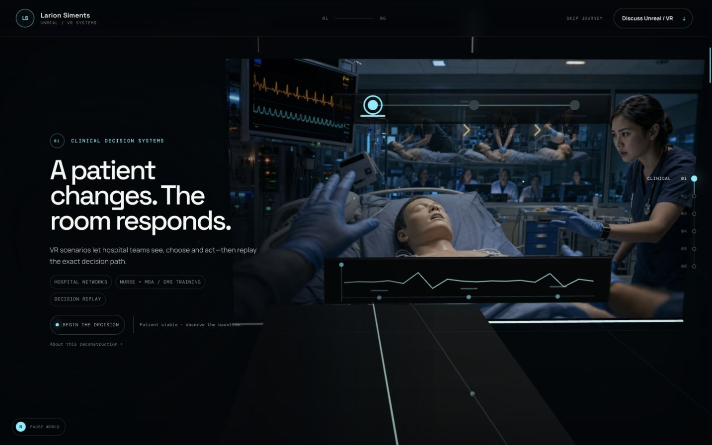
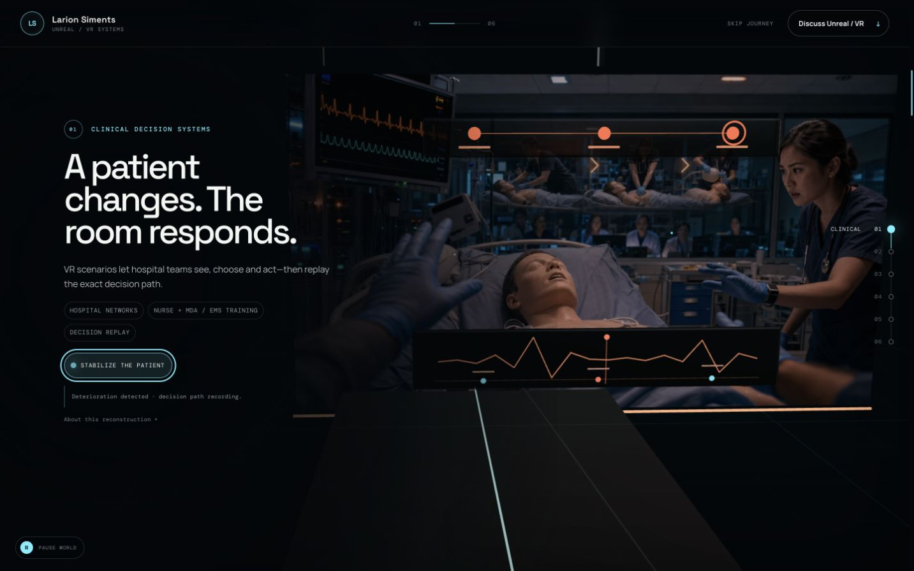
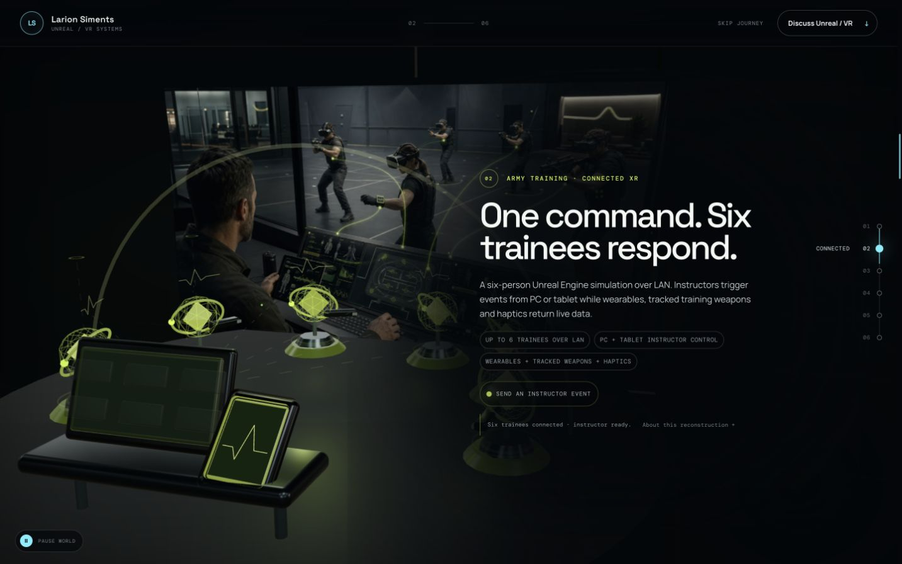
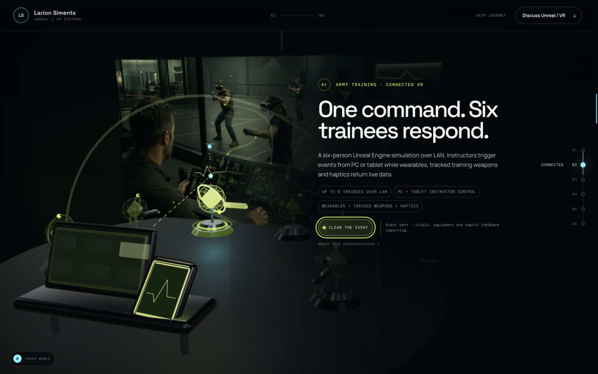
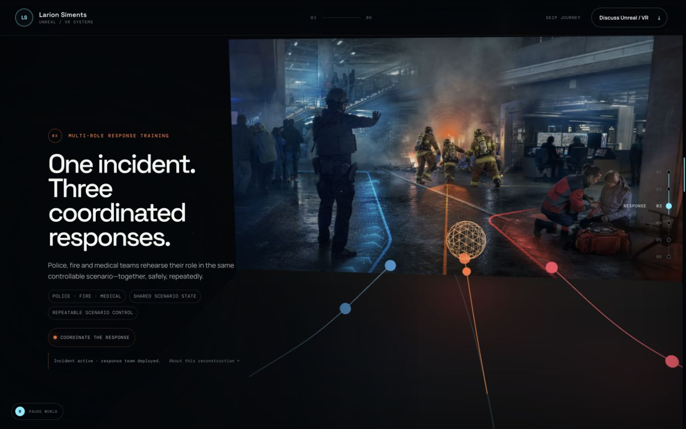
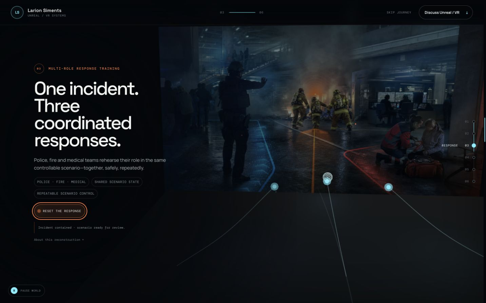

# Immersive Journey Rebuild Specification

**Status:** Proposed production specification  
**Version:** 1.0  
**Scope:** Portfolio experience, with a complete rebuild of stations 01–03 and targeted refinement of 04–07  
**Implementation status:** Documentation only; no website changes are authorized by this document  

---

## 1. Purpose

This document is the new source of truth for the next website pass.

The current experience has a strong overall direction, but stations 01–03 do not yet prove the work they describe. They present polished concept images, text, and reactive graphics inside a Three.js canvas, but the visitor is still looking at illustrated claims. The desired experience is different: the visitor should enter a credible spatial situation, perform one meaningful action, watch that action propagate through a working system, and leave with a clear understanding of what Playframe builds.

The rebuild is not a request for more effects, more neon, more text, or more detailed background images. It is a change in the storytelling model:

> The website must demonstrate systems through visible cause and effect.

Stations 01–03 are the commercial center of the site because approximately 85% of likely visitors are interested in Unreal Engine, VR, simulation, and training work. They must be the strongest and clearest parts of the journey.

This specification supersedes the visual and interaction direction for stations 01–03 in:

- STORY_FIRST_REBUILD.md
- STORY_FIRST_TASKS.md

The useful foundation of the current website may remain, but completion marks in earlier task documents are not evidence that the new standard has been met.

---

## 2. Locked strategic decisions

These decisions should not be reopened during production unless Playframe explicitly changes them:

1. The hero direction is approved and should be preserved, with only integration-level refinement.
2. Unreal Engine, VR, simulation, training, and connected experiences are the dominant market message.
3. The site must present complete, production-grade systems—not prototypes.
4. The word “prototype” should not be used as a positioning theme.
5. Stations 01–03 must be genuine spatial scenes, not flat generated images framed inside Three.js.
6. Primary project evidence must come from live 3D, approved real footage, real application interfaces, or clearly disclosed reconstruction.
7. Generated people and generated client-like interfaces must not be used as primary evidence.
8. Confidential work should be reconstructed honestly without reproducing client material.
9. The portrait should not return.
10. Location copy should not return to the finale.
11. The showreel is not required for the journey to work.
12. The CTA must remain immediately usable even when its playful interaction is ignored.
13. Vertical scrolling must remain natural. The site should not trap the visitor or require completion of a minigame.

---

## 3. The message the entire site must send

### 3.1 Primary positioning

The visitor should leave with one clear belief:

> Playframe designs and engineers production-grade Unreal and VR systems where software, people, hardware, instructor control, and live data work together.

This is more precise than “creative developer,” “XR studio,” or “immersive experiences.” It explains why the work is difficult and why a prospective client should call.

### 3.2 Supporting belief

The visitor should also understand that Playframe can carry the surrounding product:

- Instructor and operator interfaces
- Multiplayer and networking
- Tracked hardware and wearables
- Telemetry and real-time state
- Scenario logic and after-action review
- Shipped games and physical VR installations
- Mobile and companion applications

### 3.3 Visitor questions answered by the journey

The website should answer these questions in order:

1. Can he design credible training behavior and assessment?
2. Can he engineer a difficult multi-user, multi-device XR system?
3. Can he coordinate several roles inside one controllable simulation?
4. Can he create and ship an original VR game?
5. Can he connect physical installations to virtual experiences?
6. Can he design the product interfaces around the immersive work?
7. Can I trust him with my difficult brief, and how do I start?

### 3.4 What the visitor must understand by the end of station 01

The hero and first station together must establish:

- Playframe builds working systems, not isolated 3D scenes.
- Unreal/VR training is a central capability.
- The work includes the immersive world and the control, data, and review layers around it.
- Confidentiality prevents literal screenshots of some projects, but does not prevent credible proof of the underlying capability.
- The website itself demonstrates system thinking.

---

## 4. Why the current stations fail

This section is intentionally direct. It defines the problems the rebuild must remove, not merely soften.

### 4.1 A Three.js frame is not a Three.js experience

The current 01–03 scenes use cinematic generated images as the main evidence and place graphics or simple meshes in front of them. This technically uses Three.js, but the visitor is still looking at a picture.

The image supplies the people, environment, credibility, and drama. The live scene supplies decorative motion. That hierarchy is backwards.

### 4.2 The interaction is cosmetic

Current controls change waveforms, highlights, paths, or status treatments. They do not reveal a professional system with a clear input, propagation, consequence, and recorded result.

The visitor clicks, something glows, and the story remains essentially unchanged.

### 4.3 The paragraphs carry the work

The Army station only becomes impressive after the visitor reads that it supports six LAN users, instructor control, a watch, tracked weapons, haptics, and telemetry. Those facts should be visible as one connected loop.

The Clinical and Emergency stations have the same problem. Their text explains capabilities that their scenes do not demonstrate.

### 4.4 The first three stations repeat one composition

Each station currently follows a similar grammar:

- Large rectangular image
- Floating overlay
- Short caption
- One action button
- Decorative response

Repetition makes separate capabilities feel like different slides in the same presentation.

### 4.5 Generated realism damages trust

AI-generated patients, responders, facilities, and equipment create visible inaccuracies, duplicated forms, uncertain anatomy, and invented interfaces. Even when the image looks dramatic at first glance, it becomes weaker under scrutiny.

In a portfolio selling difficult, high-consequence systems, ambiguity about what is real is a marketing liability.

### 4.6 The foreground geometry loses against the background

Primitive or scaffolded geometry appears cheaper when placed in front of a photoreal image. A rounded-box bed, capsule trainee, toy vehicle, or abstract device cannot support a premium claim merely because it is animated.

### 4.7 The camera does not edit the story

Camera changes currently emphasize a card or effect. They do not take the visitor from place, to action, to consequence, to proof.

### 4.8 The stations do not escalate

The ideal sequence moves from intimate decision training, to complex connected architecture, to shared multi-role coordination. The current sequence feels like three adjacent industry examples rather than an expanding demonstration of capability.

---

## 5. The replacement storytelling model

### 5.1 Playable proof, not illustrated claims

Each of stations 01–03 becomes a focused 6–10 second primary micro-simulation, with optional debrief or replay detail extending beyond that:

1. The visitor enters a credible environment.
2. The current situation is understood without explanatory copy.
3. One professional interaction is immediately available.
4. The visitor performs that action or, in station 03, a compact role sequence.
5. The action propagates through physical, system, and instructor/debrief layers.
6. The scene resolves into a visibly different and reviewable state.
7. Replay returns the scene to a deterministic baseline.

This is not an open-world walkthrough. It is not a minigame. It is an authored interactive proof.

### 5.2 One station, one interaction verb

- 01 Clinical: **Inject**
- 02 Connected training: **Dispatch**
- 03 Emergency response: **Sequence**

Replay or Reset may appear after completion. No other control should compete before the main story is understood.

### 5.3 Three evidence layers

Every primary action must affect all three layers:

| Layer | What must change |
|---|---|
| Human or physical | Patient, trainee, responder, device, route, environment, or body state |
| System | Scenario state, network event, telemetry, hazard state, or shared logic |
| Instructor or review | Timeline, confirmation, debrief, replay, or recorded outcome |

If an interaction changes only a line, orb, status chip, or camera position, it does not pass.

### 5.4 Shared temporal grammar

Every station follows a learnable rhythm:

| Time | Phase | Visitor understanding |
|---|---|---|
| 0–1.5 seconds | Establish | Where am I, who is involved, and what is at stake? |
| Immediately | Invite | The primary action is available without waiting. |
| 1.5–3 seconds | Attract | A restrained preview makes the causal relationship readable to passive visitors. |
| 0–6 seconds after input | Act and propagate | My input changes the professional situation and moves through the system. |
| 6–10 seconds after input | Resolve | The result is visibly different and recorded. |
| Optional | Inspect/replay | I can explore the proof more deeply without being trapped. |

The sector, actor, system, and stakes must read within three seconds. The scene may play one restrained passive demonstration so visitors who do not interact still understand the essential capability. Interaction gives the visitor control, exposes a dependency, or opens the debrief; it is not a comprehension gate.

The page must never block user scrolling. If the visitor scrolls away during a sequence, the station may finish in the background, settle to a safe resolved state, or pause according to the lifecycle policy—but it may not capture the page or force completion.

### 5.5 Camera as editor

The visitor should not freely orbit the core proof scenes. Each station receives:

- An establishing composition
- A restrained action composition
- A resolution composition

Pointer movement may add subtle parallax. Scroll moves between chapters. The camera exists to reveal relationships, not to show off movement.

### 5.6 Copy-off rule

For every station, temporarily hide:

- Eyebrow
- Headline
- Body copy
- Tags
- Status text
- Navigation label

The remaining scene must still communicate:

- Sector
- Operator or participants
- Initial problem
- User action
- System response
- Result

If any of those must be explained by a paragraph, the scene is not ready.

### 5.7 Scene-led viewport

Stations 01–03 must be full-viewport, scene-led compositions rather than equal text/image splits.

- The live scene occupies the chapter background and the clear majority of visual attention.
- On desktop, the confirming copy layer should normally use no more than 24–28% of viewport width.
- On mobile arrival, copy and controls should normally use no more than 30% of viewport height before expansion.
- No opaque content panel may cover a primary actor, action, or consequence.
- Technical detail remains collapsed until requested.
- The three stations must not reuse the same caption position, camera composition, and framed rectangle.

### 5.8 Commercial outcome confirmation

Every resolved state should end with one concise buyer outcome after the system has visually proved itself:

- 01: repeat safely, measure decisions, review the moment.
- 02: coordinate the whole session with instructor visibility.
- 03: rehearse joint dependencies without real-world exposure.

This is a confirmation, not a second paragraph. Mechanics show what was built; the outcome explains why a client funds it.

---

## 6. Journey architecture

### 6.1 Chapter sequence

| Station | Commercial role | Visitor takeaway |
|---|---|---|
| 00 Hero | Positioning | Complex real-time experiences, engineered end to end |
| 01 Clinical | First proof | Consequential decisions can be controlled, measured, and replayed |
| 02 Connected training | Technical proof | Multiple users, devices, inputs, haptics, and telemetry operate as one system |
| 03 Emergency | Scenario proof | Different professional roles share one causal simulation |
| 04 Hover The Edge | Shipped creative proof | Original embodied VR gameplay can be designed and released |
| 05 FlyboxVR | Physical integration proof | Human posture and a physical installation become convincing virtual flight |
| 06 Applications | Product proof | The surrounding dashboards and apps receive the same product discipline |
| 07 CTA | Conversion | Bring the difficult brief; Playframe can shape it into one working experience |

### 6.2 Escalation

The first three stations must expand in scope:

- 01 is intimate: one room, one changing patient, one decision, one debrief.
- 02 is architectural: one instructor, six connected trainees, multiple devices, bidirectional data.
- 03 is operational: several professional roles change one shared incident through dependent actions.

The visual language should broaden with the systems:

- Close bedside framing
- Facility-scale cutaway
- Incident-scale operational overview

### 6.3 Transition motif

A restrained state signal may transform between chapters:

- Clinical waveform becomes a network packet.
- Network packet becomes an incident command path.
- Safe emergency route becomes the Hover track.
- Hover energy becomes Flybox airflow.
- Airflow vectors become mobile data streams.
- Product modules become the pieces assembled in the CTA.

This motif provides continuity but must never become a glowing ribbon pasted over every scene.

---

## 7. Station 01 — Clinical decision training

### 7.1 Commercial job

This station must prove that Playframe creates consequential, controllable, measurable, and replayable clinical training. It must not read as:

- A hospital advertisement
- A generic emergency-room visualization
- A medical dashboard concept
- An AI-generated patient poster

It is the first serious proof after the approved hero and therefore sets the quality contract for the entire website.

### 7.2 Required viewer takeaway

After one interaction, the visitor should be able to say:

> An instructor injects a clinical event into a VR scenario; the virtual patient and room respond, the trainee response is captured, and the event can be reviewed.

### 7.3 Confidentiality tier

**Capability reconstruction.**

The environment, patient, equipment arrangement, values, and interface must be original and synthetic. The capability may reflect delivered work, but no client room, UI, data, logo, uniform, protocol, or identifying asset should be reproduced.

Quiet disclosure:

> Original reconstruction illustrating delivered training capabilities. No client material is shown.

The disclosure belongs in an optional “About this reconstruction” detail, not in the main headline.

### 7.4 Environment

Build one complete, coherent 3D clinical simulation bay:

- Credibly scaled bed or high-quality simulation mannequin
- Patient/mannequin integrated into the live 3D scene
- Bedside monitor with a deliberately designed synthetic interface
- Relevant cart and restrained clinical equipment
- Floor, wall, ceiling, rails, sockets, and lighting that establish a real room
- Glazed instructor observation position or visible control station
- One trainee presence, preferably a tasteful licensed animated figure, first-person hands, or a restrained silhouette with credible posture
- A physically located debrief surface that belongs to the observation layer
- A clearly identifiable HMD/tracked trainee relationship to the virtual bedside experience

The mannequin or patient should be deliberately reconstructed rather than pseudo-photoreal. A premium digital-twin treatment is preferable to an uncanny fake human.

Generated imagery may be used only for distant, defocused set extension or reflections. It must not depict the primary patient, trainee, equipment, or action.

The scene must connect two live 3D domains:

1. **Physical training layer:** trainee/HMD or tracked hands, instructor control, and observation/debrief.
2. **Virtual scenario layer:** the patient room, virtual hands/presence, live patient state, and scenario response.

The camera may cross a designed training boundary or use a cutaway to connect them, but it must not reduce the virtual domain to a flat screen. With copy hidden, the station must read specifically as VR-enabled clinical training—not only mannequin-based hospital training.

### 7.5 Spatial composition

The opening three-quarter composition must contain, in one readable frame:

1. Patient/mannequin
2. Bedside monitor
3. Trainee position
4. Instructor observation layer
5. A clear mapping between physical trainee/HMD and the shared virtual patient scene

The visitor should immediately understand that this is a VR training environment, not merely a patient room. The HMD/tracked presence, observation layer, synthetic scenario marker, and dormant debrief timeline should establish that distinction before copy appears.

### 7.6 Exact story beats

#### State A — Arrival

- The physical trainee/HMD and virtual bedside environment are connected in one quick, legible reveal.
- Room is calm and operational.
- Patient/mannequin has subtle breathing or equivalent baseline movement.
- Vitals are coherent and stable.
- Trainee is at the bedside, not performing a dramatic action.
- Instructor timeline is visible but dormant.
- No red alarm lighting is present.

#### State B — Invitation

- The instructor-side scenario injection control becomes the single focus.
- Prompt: “Inject scenario event.”
- The control is visually connected to the room without overlaying the patient.
- A DOM button and a clear 3D hit target invoke the same action.
- The control should feel like a scenario-state input, not a generic website play button.

#### State C — Injection

The visitor acts as the instructor/scenario operator. This avoids turning the portfolio interaction into medical advice.

On input:

- The scenario clock begins.
- Patient/mannequin breathing or posture changes.
- Monitor values and waveform change coherently.
- A local alert state activates.
- The instructor timeline records the injected event.

The first response must begin within 100 milliseconds. The complete state change may unfold over 1–2 seconds.

#### State D — Trainee response

A short, authored response demonstrates that the training world is stateful:

- Trainee attention moves to the patient/monitor.
- One context-appropriate training action occurs without teaching a protocol.
- Equipment and room feedback respond to the same scenario state.
- The instructor trace records the response timestamp.

The action must be clinically reviewed before publication. It should demonstrate training behavior, not instruct a real viewer how to treat a patient.

Until that review is complete, the greybox should use a neutral response such as attention shift, escalation/team-call confirmation, and equipment-state acknowledgement. A specific treatment choice must not be invented by the visual team.

#### State E — Resolution

- Patient/mannequin state settles.
- Vitals move to a clearly improved but still synthetic condition.
- Alert emphasis recedes.
- The camera reveals the instructor/debrief layer.
- A compact timeline shows: scenario trigger → trainee response → outcome.

End status:

> Response captured · ready to review

Outcome confirmation:

> Repeat safely · measure decisions · review the moment

#### State F — Replay

- The visitor may scrub the captured timeline once or reset to baseline. This inspection step gives station 01 a different form of agency from Dispatch and Sequence.
- Reset must restore patient, vitals, clock, trainee pose, lighting, audio, camera emphasis, and timeline.
- No alarm should loop automatically while the visitor is reading.

### 7.7 Causal output requirement

The Inject action must visibly affect at least five concrete outputs:

1. Patient/mannequin body state
2. Monitor/waveform state
3. Room light or localized alert treatment
4. Trainee response
5. Instructor timeline/debrief

Changing only a monitor graphic and timeline does not pass.

### 7.8 Camera direction

#### Desktop

- Establish: approximately 35–45mm equivalent at the foot/side of the bed.
- Action: a restrained 5–8% dolly toward the patient and monitor.
- Resolution: a slight pullback or lateral reveal that includes the observation/debrief layer.
- No orbit around the bed.
- No sudden depth-of-field shift that makes the proof unreadable.

#### Mobile

- Author a separate close composition.
- Keep patient and monitor visible together.
- Reveal the instructor layer with a controlled cut or short move.
- Do not crop the desktop shot and hope the subject remains legible.

### 7.9 Visual hierarchy

Order of attention:

1. Patient state
2. Monitor response
3. Trainee action
4. Instructor/debrief record
5. Room detail

Clinical white, neutral grey, and restrained cool light form the baseline. Amber/red is reserved for the scenario event and must recede after resolution.

Do not fill the entire room with cyan light. Do not float waveforms in empty space when they can belong to a real monitor or observation surface.

### 7.10 Copy direction

Recommended starting copy:

- Eyebrow: **Clinical decision training**
- Headline: **A patient changes. The room responds.**
- Support: **Configurable scenarios connect patient state, trainee action, live feedback, and replayable debrief.**
- Proof tags: **Scenario control** · **Live state** · **Debrief replay**
- Primary action: **Inject scenario event**

Any claim about hospital coverage, nursing audiences, or Magen David Adom (MDA) must be factually verified and approved before publication. It should appear as a concise proof fact, not be implied by the fictional reconstruction.

### 7.11 Audio

Audio is optional and muted by default.

If included:

- Baseline monitor tone must be subtle.
- The scenario event may add one restrained alert.
- Resolution must quiet the alert.
- Audio must never be required to understand the story.
- A visible mute control and reduced-motion/sensory-safe mode are required.

### 7.12 Asset requirements

Required hero assets:

- Clinical room shell
- Bed or simulation bed
- Mannequin/patient representation
- Bedside monitor
- Small equipment/cart set
- Instructor glazing/console
- One restrained trainee representation or hand animation
- HMD/tracked-hands representation and a legible mapping to the virtual bedside world

Every asset needs:

- Source URL
- Author
- License
- Commercial-use status
- Attribution requirement
- Date acquired
- Modifications
- Optimized output path

No primitive proxy may remain visible in final production screenshots.

If existing hospital media is approved for use, it may appear as small secondary proof inside the instructor/debrief layer. It must not replace the live patient-room story, and it must not reveal protected client information.

### 7.13 Acceptance criteria

The station is approved only if:

- With all copy hidden, at least 80% of target viewers identify clinical training rather than a hospital advertisement.
- Viewers identify a VR trainee/instructor relationship, not only a physical mannequin exercise.
- Viewers understand that an instructor injects a scenario event.
- Viewers see a change in patient, room, trainee, and debrief—not merely a graphic overlay.
- Beginning, action, consequence, and recorded outcome are identifiable in a silent loop.
- The resolved state is clearly different from the baseline in a still screenshot.
- No generated patient or fake client UI carries the story.
- No anatomy, equipment, value, or motion appears obviously implausible.
- The desktop and mobile compositions preserve the patient/monitor relationship.
- Replay succeeds ten consecutive times without state drift.
- This station is at least as polished as any later station.

### 7.14 Explicit rejection conditions

Reject the station if any of the following is true:

- The patient exists mainly inside a flat image.
- The scene could be described as “hospital image plus HUD.”
- The physical trainee/HMD and virtual patient scene are not visibly connected.
- The visitor must read the body copy to discover the instructor/debrief loop.
- Interaction changes fewer than three evidence layers.
- Floating medical graphics have no physical or narrative origin.
- The mannequin, equipment, or animation reads as a placeholder.
- The alarm state auto-loops continuously.

---

## 8. Station 02 — Connected multi-user army training

### 8.1 Commercial job

This station must prove the unusual system architecture:

- Unreal-based multiplayer
- Up to six simultaneous users over LAN
- Instructor control from PC and tablet
- Live event injection
- Watch-based vital input
- Tracked gun/rifle input
- Haptic suit output
- Telemetry returned for review

The point is orchestration and engineering, not battlefield spectacle.

### 8.2 Required viewer takeaway

After one interaction, the visitor should be able to say:

> An instructor dispatches an event to six connected trainees; their tracked equipment, wearable data, and haptics participate in the scenario, and telemetry returns to the instructor.

### 8.3 Confidentiality tier

**Capability reconstruction.**

Use an original neutral training facility, synthetic data, generic personnel, and legally safe device representations. Accurate sanitized representations of the real integration categories are preferred when factually and legally permitted. Do not recreate:

- Client interface
- Mission content
- Maps
- Tactical layout
- Insignia
- Uniform markings
- Radio text
- Protected procedures
- Identifying facility details

Quiet disclosure:

> Original reconstruction of a delivered multi-user training architecture. Operational content is withheld.

### 8.4 Environment

Build one continuous 3D training facility containing:

- Instructor PC console
- Instructor tablet
- Visible LAN/network point or spatially intelligible network layer
- Exactly six countable trainee positions
- Headset/trainee silhouettes with credible stance
- Accurate sanitized Galaxy Watch, WonderFitter, and bHaptics categories when approved; generic equivalents only when required
- A live shared Unreal event space containing six mapped embodied instances
- A clear mapping from each physical trainee/device stack to its virtual participant
- Returned telemetry on the instructor side

The facility may use a clean cutaway or controlled training-bay architecture. It should feel engineered and deliberate, not like a generic sci-fi room or war-game poster.

The scene must show both domains at once or in one immediate authored reveal:

1. **Physical domain:** instructor, PC/tablet, LAN, six trainees, watch, tracked weapon, and haptics.
2. **Virtual domain:** six embodied participants sharing one live Unreal scenario.

The shared Unreal world must be live 3D, not a tactical screenshot or flat background. The connection between physical input and virtual consequence is one of the station’s main proofs.

### 8.5 Spatial composition

The opening view is over or near the instructor position. The PC/tablet is foreground evidence, all six physical participants are visible in depth, and the shared virtual world is legibly mapped to them.

All six users must be countable without reading a number. They may occupy:

- Six training bays
- A hexagonal facility arrangement
- Six positions around a shared virtual training volume

They must not be six glowing capsules or anonymous decorative beacons.

### 8.6 Exact story beats

#### State A — Network ready

- Instructor console shows one connected session.
- All six trainee positions show quiet ready state.
- Devices are present and readable, not all flashing.
- A restrained network topology makes the facility relationship understandable.
- All six virtual instances are present in one dormant shared event space.

#### State B — Target

- One trainee or the full group becomes selectable.
- Default interaction should use the full group so the six-person fact is immediately proven.
- Selection is reflected at instructor, participant, and device layers.

#### State C — Dispatch

Prompt:

> Send instructor event

On input:

- Instructor PC/tablet confirms the command.
- A directional outbound signal travels through the LAN layer.
- All six positions receive the same scenario event.
- The live Unreal environment changes coherently for all six mapped virtual participants.

The outbound path must have clear direction and must not look like a constantly animated decorative network.

#### State D — Selected trainee detail

The camera gives one participant slightly more attention while preserving group context.

At least four device/system outputs change:

- Haptic vest activates through a restrained panel pulse or body response.
- Tracked weapon state changes or aligns with the simulated event.
- Watch/vital trace changes.
- Headset/trainee posture reflects the event.
- The mapped virtual body changes in direct relationship to the physical input/output.
- Other five participants remain visibly synchronized to the same session.

The scene should show physical input/output categories, not attempt to reproduce confidential hardware behavior.

#### State E — Telemetry return

- A visually distinct signal returns from trainee/device to instructor.
- Return direction, timing, and color/pattern differ from the outbound command.
- Instructor view records participant, event time, response, and vital trace.
- The selected participant and returned record remain visible in one composition.

End status:

> Event delivered · telemetry received

Outcome confirmation:

> One synchronized session · instructor visibility across people, devices, and response

#### State F — Replay

- Replay re-runs the dispatch and return loop once.
- Reset restores all six participants, simulated event, devices, instructor UI, paths, camera, and status.

### 8.7 Causal output requirement

Dispatch must visibly affect:

1. Instructor PC/tablet
2. LAN path
3. Six participants
4. Shared Unreal event
5. At least three device categories
6. Returned telemetry

A selected glowing node and status change do not pass.

### 8.8 Camera direction

#### Desktop

- Establish: over-instructor-shoulder, approximately 40–50mm equivalent.
- The console and all six participants must be visible together.
- Dispatch: a restrained rail/push follows the outbound event.
- Detail: no more than a small damped rotation and dolly toward the selected participant.
- Resolution: selected participant and returned instructor telemetry share the frame.

#### Mobile

- Use a two-shot authored sequence:
  1. Instructor plus a clearly countable six-user session layout
  2. Selected trainee plus the return to instructor
- Do not compress six tiny people into an unreadable desktop crop.
- The other five users may remain as a countable synchronized strip or spatial layer during the detail shot.

### 8.9 Visual hierarchy

Order of attention:

1. Instructor action
2. Six-person session
3. Selected trainee and device stack
4. Returned telemetry
5. Facility detail

Use separate visual languages for:

- Ready/session state
- Outbound event
- Return/verification

Direction must also be communicated through motion and pattern, not color alone.

Avoid constant neon. The network should become visually active only when it is telling the dispatch/return story.

### 8.10 Copy direction

Recommended starting copy:

- Eyebrow: **Connected XR training**
- Headline: **One command. Six trainees respond.**
- Support: **A LAN session connects instructor control, tracked hardware, wearables, haptics, and returning telemetry.**
- Proof tags: **6-person LAN** · **Wearables + haptics** · **Instructor control**
- Primary action: **Send instructor event**

Galaxy Watch, WonderFitter, and bHaptics should be named and represented accurately when the integration facts and trademark treatment are approved. Genericized replicas are the fallback for legal or confidentiality constraints, not the default creative direction.

### 8.11 Asset requirements

Required hero assets:

- Instructor workstation
- Tablet
- Six credible trainee/headset representations
- Accurate sanitized watch, haptic vest, and tracked weapon categories when approved
- Facility shell and training bays
- Live shared Unreal event volume with six mapped virtual participants
- Designed synthetic instructor UI

Repeated participant and hardware components should use shared geometry, instancing, and material variants where appropriate.

### 8.12 Acceptance criteria

The station is approved only if:

- With copy hidden, viewers can point to the instructor, six participants, devices, simulation, and returning telemetry.
- Viewers can distinguish the physical facility from the shared virtual Unreal world and understand the mapping between them.
- All six participants are countable.
- The system reads as bidirectional.
- At least four integration categories are visually identifiable.
- The instructor action visibly reaches participants.
- The physical/device response visibly returns as data.
- Viewers describe systems engineering rather than merely “military VR.”
- The scene contains no protected operational content.
- Desktop and mobile preserve both ends of the causal loop.
- Replay succeeds ten consecutive times without stale selection or path state.

### 8.13 Explicit rejection conditions

Reject the station if:

- It is a military image with six glowing nodes placed over it.
- The laptop/tablet is unreadable or disconnected from the event.
- The six participants are implied by text rather than visible.
- Outbound and returned data look identical.
- Hardware categories exist only as icons or copy.
- The six physical trainees are shown without six embodied instances in one shared Unreal world.
- The scene sells combat spectacle rather than connected training architecture.
- The selected participant is shown at the cost of losing all group context.

---

## 9. Station 03 — Coordinated emergency response

### 9.1 Commercial job

This station must prove that Playframe can build a shared scenario where police, fire, and medical roles affect one another inside the same controllable incident.

It must be clearly different from station 02:

- Station 02 proves connected architecture and hardware integration.
- Station 03 proves scenario design, dependency, timing, role coordination, and shared outcome.

### 9.2 Required viewer takeaway

After one interaction, the visitor should be able to say:

> Police, fire, and medical teams act on the same incident; one role changes what another role can safely do, and the coordinated outcome can be reviewed.

### 9.3 Confidentiality tier

**Tier C — Category concept by default.**

This station may be upgraded to a Tier B capability reconstruction only after the exact delivered capability claim is verified and the disclosure is rewritten accordingly. Until then, implementation and copy must treat the incident as an original example of the kind of multi-role training Playframe can build.

No existing media should be used. Create a wholly original fictional incident. Do not reproduce:

- Real event
- Real agency UI
- Protected operational procedure
- Client layout
- Real tactical route
- Identifying signage

Quiet disclosure:

> Original concept scene demonstrating multi-role coordination. It is not client footage or operational guidance.

### 9.4 Environment

Build one readable 3D incident environment, such as:

- Industrial loading bay
- Transit service area
- Small warehouse exterior/interior threshold
- Urban service yard

The environment needs:

- One clear hazard source
- One casualty or evacuation objective
- One blocked or unsafe access route
- Police staging/action area
- Fire staging/action area
- Medical staging/action area
- Shared instructor/incident timeline
- A visibly different resolved state

Use credible commercial-safe environment, vehicle, tool, and responder assets. Avoid a tiny toy diorama. Avoid a group portrait.

### 9.5 Spatial composition

The establishing view should show the whole causal problem:

1. Hazard
2. Blocked route
3. Casualty/evacuation objective
4. Three staged roles

Role paths should remain anchored to the ground and appear only when relevant. They are secondary guidance, not the main art.

### 9.6 Exact story beats

#### State A — Active incident

- Hazard is active but visually controlled enough to preserve legibility.
- Smoke/heat or environmental risk makes one route unsafe.
- Casualty/evacuation objective is visible.
- Police, fire, and medical teams are staged.
- Medical access is clearly blocked by scenario state.
- Shared timeline is dormant.

#### State B — Invitation

Prompt:

> Choose what happens next

The incident command marker and three role controls become actionable immediately. The three teams visibly wait on one shared plan/state.

If the visitor does not interact, one restrained passive demonstration may reveal the scenario-specific dependency chain. If the visitor chooses a role, the passive demonstration stops and the visitor controls the sequence.

#### State C — First sequencing decision

The visitor chooses which fictional role acts next:

- Choosing Medical first previews the unsafe heat/smoke boundary, pauses the team before entry, and explains the blocked environmental state without penalty.
- Choosing Fire first reveals that the fictional access lane remains physically obstructed.
- Choosing Police clears the specific access obstruction/perimeter condition in this authored scenario and unlocks the next valid state.

This is not a universal response order. It is a visible dependency designed for this fictional incident and must be framed as such.

On the valid first action:

- Police secures or opens the perimeter/route boundary.
- A physical obstruction, crowd state, gate, or unsafe edge changes.
- The shared timeline records the action.
- Fire access becomes possible.

This should be a visible world change, not simply a blue line activating.

#### State D — Second sequencing decision

- The visitor chooses the next role.
- Fire can now reach the fictional hazard; medical remains visibly blocked by environmental risk.
- Suppression changes smoke, flame, heat, lighting, and risk state.
- The route is not declared safe until the environmental condition changes.
- The shared timeline records containment progress.

#### State E — Final sequencing decision

- The visitor selects Medical only after the fictional hazard falls below its safe scenario threshold.
- Medical team reaches the casualty/evacuation objective.
- Casualty/route state changes.
- All three teams remain visible in their resolved positions.

#### State F — Shared resolution

- Hazard intensity has visibly dropped.
- Safe corridor is established.
- Objective is reached or extraction begins.
- Timeline shows the role sequence and dependencies.

End status:

> Incident contained · response ready for review

Outcome confirmation:

> Rehearse joint dependencies without real-world exposure

#### State G — Replay/reset

- Replay may step through the dependency chain.
- Reset restores hazard, route, obstruction, casualty state, team staging, lighting, smoke, timeline, camera, and status.

### 9.7 Causal output requirement

Sequence must visibly change:

1. Police-controlled world state
2. Fire-controlled hazard state
3. Medical access state
4. Casualty/evacuation state
5. Shared incident timeline

Three colored paths animating simultaneously do not pass. The order must visibly matter. A blocked selection must explain itself through the changing world and recover immediately; it must never feel like a punitive quiz.

### 9.8 Camera direction

#### Desktop

- Establish: elevated 30–35mm oblique view.
- Keep all three teams, the hazard, and the blocked route in one spatial model.
- Coordination: a slow descending dolly follows the evolving incident without spinning.
- Resolution: pull back enough to reveal all final positions and the cleared corridor.

#### Mobile

Use two authored compositions:

1. Incident overview with all roles and blocked route
2. Resolved corridor with role sequence still understandable

Do not turn the scene into an unreadable miniature.

### 9.9 Visual hierarchy

Order of attention:

1. Incident/hazard state
2. Current responding role
3. Dependency and route change
4. Shared outcome
5. Supporting UI

Police, fire, and medical must have:

- Distinct silhouette/gear
- Distinct icon or endpoint shape
- Distinct path pattern
- Accessible color treatment

Color may reinforce role but cannot be the only identifier.

### 9.10 Copy direction

Recommended starting copy:

- Eyebrow: **Coordinated response training**
- Headline: **Three roles. One changing incident.**
- Support: **Police, fire, and medical roles share one scenario where timing and dependencies change the outcome.**
- Proof tags: **Shared scenario** · **Role dependencies** · **After-action review**
- Primary action: **Choose next role**

The interaction is a capability demonstration, not operational advice.

### 9.11 Asset requirements

Required hero assets:

- Incident environment
- Hazard source and controlled effect system
- Police responder category
- Fire responder category
- Medical responder category
- Relevant service vehicles/tools only where they support story
- Casualty/evacuation objective
- Route/obstruction props
- Designed incident timeline

Smoke, fire, lighting, and route effects must respond to shared state. They cannot be pre-rendered into a flat image.

### 9.12 Acceptance criteria

The station is approved only if:

- With copy hidden, viewers identify a multi-role training scenario rather than an emergency-services advertisement.
- Police, fire, medical, hazard, route, and shared objective are distinguishable without labels.
- Viewers understand that role order matters.
- One role visibly changes what the next role can do.
- At least one early role choice visibly demonstrates why an action is blocked, then returns control without penalty.
- Passive viewers still see the essential dependency through one restrained attract sequence.
- The whole environment transforms during containment.
- Replay/reset is observable and deterministic.
- The station cannot be summarized with the same sentence as station 02.
- No real event or protected operational content is implied.

### 9.13 Explicit rejection conditions

Reject the station if:

- It uses an AI group portrait as the main scene.
- Police, fire, and medical are merely three colored lines.
- All three roles animate independently with no dependency.
- One “Coordinate” button merely auto-plays the entire chain as the only interaction.
- Smoke/fire is a background texture and does not respond to the state.
- Containment changes a status chip but not the environment.
- The scale or assets read as a toy scene.
- The viewer needs the paragraph to understand what is being trained.

---

## 10. Stations 04–07

These stations do not require the same conceptual restart as 01–03, but they must be integrated into the new causal journey.

### 10.1 Station 04 — Hover The Edge

#### Preserve

- Real game footage as primary proof
- Hoverboard rather than spaceship
- Embodied forward movement
- Stronger, more playful pace after the training chapters

#### Improve

- The board must respond directly to pointer/touch lean.
- Camera banking and board tilt must share one physical relationship.
- Boost must visibly affect speed, field motion, particles, audio, and footage/scene treatment.
- The story should communicate traversal, danger, pickups, boost, and extraction.
- Props must support footage rather than cover it.
- The board must remain readable at mobile sizes.
- The transition from the emergency safe route should become the Hover track.

#### Proof hierarchy

Real released-game footage first, interactive board second, environmental props third, copy last.

### 10.2 Station 05 — FlyboxVR

#### Preserve

- Real video as the dominant surface
- Prone body orientation
- Tunnel/airflow idea

#### Improve

- Participant footage receives more screen area than the 3D props.
- Any 3D body/character must face downward in a credible flight posture.
- Airflow should react to interaction and visually connect body input to virtual movement.
- Props should form a physical frame/tunnel, not a competing low-poly scene.
- Camera angle should preserve the body-to-flight relationship.
- Desktop and mobile need separate video crops/encodes.

#### Proof hierarchy

Real participant footage first, body/input relationship second, airflow/tunnel props third, copy last.

### 10.3 Station 06 — Mobile products

#### Preserve

- Real product screenshots
- Tactile three-phone exploration
- Nomad Home, MoneyNest, and BiteSync as a broad application category

#### Improve

- Only one phone should be the readable focal product at a time.
- Non-focused phones remain discoverable without overlapping the active phone.
- Replace any Hebrew screenshot used in the primary focal position.
- Normalize screen resolution, color, and device framing.
- Fix drag/settle overlap and stacking bugs.
- Use one shared physical phone model with instanced or reused geometry.
- Let each focus change cause a calm camera offset and lighting response.
- Keep the section subordinate to the Unreal/VR positioning.

### 10.4 Station 07 — Interactive CTA

#### Required takeaway

> Bring the difficult brief: people, hardware, environment, and outcome. Playframe can shape them into one working experience.

#### Interaction

Let the visitor select one of three directions:

- Training simulation
- Connected XR
- Interactive experience

Relevant components assemble into a small, satisfying system in front of the visitor. The result should feel like the beginning of their project, not a decorative sculpture.

Selection may prefill the contact subject. The playful interaction is optional.

#### Conversion requirements

- Email and WhatsApp remain immediately visible and usable.
- A visitor can begin contact within three seconds of entering the finale.
- No location copy.
- No generic six-sphere object.
- No “Let’s create magic” language.
- The CTA explains what kinds of briefs are welcome and what happens after contact.

Suggested copy direction:

- Eyebrow: **Your system starts here**
- Headline: **Bring the difficult brief.**
- Support: **Training, connected XR, or an interactive world—let’s turn the people, hardware, and outcome into one working experience.**
- Primary action: **Start a project**
- Secondary: **Email** / **WhatsApp**

---

## 11. Art direction

### 11.1 Credibility over spectacle

Premium means:

- Plausible scale
- Grounded objects
- Clear physical relationships
- Restrained, purposeful animation
- Deliberate lighting hierarchy
- Materials that belong in the same world
- Immediate comprehension

Premium does not mean:

- Maximum polygon count
- Constant bloom
- Cyan lighting everywhere
- Floating rectangles
- Arbitrary particles
- Dense fake dashboards
- Fast camera moves

### 11.2 Station identities

The site should remain visually coherent, but stations need distinct worlds:

| Station | Material/lighting identity |
|---|---|
| Clinical | Controlled clinical whites, soft neutral materials, localized scenario amber |
| Connected training | Dark neutral facility, restrained equipment lighting, directional network states |
| Emergency | Environmental atmosphere, practical service lighting, hazard-driven contrast |
| Hover | Saturated speed, wind, track energy, embodied motion |
| Flybox | Airflow, tunnel depth, real video prominence |
| Apps | Calm precision, readable screens, tactile product materials |
| CTA | Components converge into a new system with warm, optimistic energy |

### 11.3 Geometry threshold

The following may be used in greybox only and must not appear in final evidence:

- Capsule people
- Rounded-box beds
- Toy rifles
- Primitive emergency vehicles
- Placeholder consoles
- CSS-like 3D rectangles
- Unfinished mannequin scaffolds
- Generic orbiting spheres

Use licensed commercial-quality assets when they are stronger and faster than bespoke modeling. Custom Blender work should focus on:

- Composition-specific connectors
- Original facility elements
- Device housings
- UI surfaces
- Transitions
- Hero props unavailable at the required quality

### 11.4 AI imagery boundary

Generated imagery may be used for:

- Concept development
- Distant set extension
- Defocused reflections
- Low-frequency atmosphere
- Non-evidentiary fallback exploration before final assets exist

Generated imagery may not be used for:

- Primary people
- Primary patient
- Primary responder
- Primary device
- Claimed interface
- Claimed action
- Claimed outcome

A flat image plane must not be among the three strongest visual elements in stations 01–03.

### 11.5 Lighting and grounding

- Use physically plausible scale.
- All hero objects require contact shadow or baked grounding.
- Environment lighting should be stable; story events may use a small number of controlled real-time lights.
- Avoid idle bobbing.
- Avoid props floating without visible support.
- Avoid bloom that destroys silhouettes or UI readability.
- Reduce visual energy after resolution so the visitor feels completion.

---

## 12. Camera and motion system

### 12.1 Shot map

Before asset production, approve three images or animatic frames for every station:

1. Establish
2. Action
3. Resolution

The DOM caption and controls must be tested against all three. No proof object may pass behind body copy during the causal sequence.

### 12.2 Movement rules

- No uncontrolled orbit in 01–03.
- No camera movement solely to add excitement.
- User page scrolling is never blocked or captured.
- While a primary sequence is active, its local camera animation should use the station timeline rather than jittering with scroll progress. If the user leaves the chapter, lifecycle rules take over immediately.
- Pointer parallax should remain subtle and pause during the causal sequence.
- Transition moves should use spatial or lighting match cuts.
- Every move should settle fully before the next reading state.

### 12.3 Responsive shots

Desktop, tablet, phone portrait, and short phone landscape need authored poses or safe framing rules.

Mobile is not a cropped desktop camera.

### 12.4 Reduced motion

Reduced-motion mode must preserve:

- Baseline
- Action
- Consequence
- Resolution
- Replay

Use controlled cuts and state changes instead of removing the story. A static decorative fallback is not equivalent.

---

## 13. Information hierarchy and copy

### 13.1 Order of communication

Every station communicates in this order:

1. Visible professional situation
2. Visible user/system action
3. Visible consequence
4. Short title confirming what was seen
5. One factual proof
6. Optional technical detail/confidentiality disclosure

### 13.2 Copy limits

| Element | Limit |
|---|---|
| Eyebrow | 2–5 words |
| Headline | Maximum 8 words or two very short clauses |
| Support | Maximum 24–28 words |
| Proof tags | Maximum 3 |
| Primary action | One specific verb phrase |
| Status | Only what just changed |

### 13.3 Language rules

- Do not use “prototype” as positioning.
- Do not use vague claims such as “cutting-edge solutions.”
- Do not repeat “simulation,” “immersive,” “real-time,” or “system” multiple times in one station.
- Do not list a feature that the scene cannot show.
- Use exact, supportable facts.
- Use production language: builds, engineers, connects, deploys, controls, records, ships.
- Avoid inflated metrics and unsupported superlatives.

### 13.4 Proof strip

A compact proof strip may appear after the hero or during the early journey, using only approved facts such as:

- Deployed training
- Six-user LAN
- Tracked hardware + wearables
- Released VR title

It should not become another dense navigation bar.

### 13.5 Optional detail

Interested buyers may open one small disclosure per station:

- How it works
- Technical facts
- About the reconstruction

The detail should never be required to understand the main journey.

---

## 14. Proof and trust framework

Every meaningful visual or claim must be classified:

| Tier | Meaning | Treatment |
|---|---|---|
| A — Direct evidence | Approved real footage, interface, screenshot, or release link | Present as real proof |
| B — Capability reconstruction | Original scene based on genuine delivered capability | Disclose quietly and precisely |
| C — Category concept | Original example of what Playframe can build | Never present as literal client work |

Rules:

1. Real footage outranks reconstruction.
2. Reconstruction outranks abstract decoration.
3. Generated imagery never masquerades as evidence.
4. Confidentiality disclosure should increase trust, not apologize.
5. No client logo appears without permission.
6. No unsupported deployment or usage claim appears.
7. Medical behavior receives credibility review.
8. Military work emphasizes architecture and training behavior, not combat spectacle.
9. A release/store/project link should be included when appropriate and available.

---

## 15. Technical architecture changes

The current foundation is worth preserving:

- One global React Three Fiber canvas
- DOM-first content and accessible controls
- Lazy WebGL startup
- WebGL failure and reduced-motion fallbacks
- Centralized journey state
- Authored desktop/mobile shots
- Current/adjacent scene gating
- Poster-first video behavior
- Controlled DOM/3D interactions

The rebuild should refine this foundation rather than restart the entire application.

### 15.1 Remove or retire

- EvidenceBackdrop as the primary storytelling device in 01–03
- clinical-decision-v2.webp as primary station evidence
- tactical-system-v2.webp as primary station evidence
- emergency-coordination-v2.webp as primary station evidence
- Dead hospital/emergency diorama components
- Unused production meshes and exports
- Repeated evidence-frame implementations
- Repeated one-off geometry/material creation
- Always-loaded environment assets that are not visible/necessary
- Unused post-processing dependencies
- Runtime Google Fonts dependency
- Contradictory task documents as active sources of truth

Source assets may be archived outside the deployed public folder rather than destructively deleted until the new build is approved.

### 15.2 Split the monolithic scene files

Target organization:

    src/
      journey/
        registry.ts
        camera.ts
        reducer.ts
        actions.ts
        assetManifest.ts
        quality.ts
      three/
        core/
          JourneyCanvas.tsx
          StationManager.tsx
          SceneLighting.tsx
          VideoSurface.tsx
          useManagedVideo.ts
          useStationLifecycle.ts
          sharedGeometry.ts
        stations/
          00-intro/
          01-clinical/
          02-connected-training/
          03-emergency/
          04-hover/
          05-flybox/
          06-apps/
          07-contact/
      ui/
        journey/
        controls/
      styles/
        tokens.css
        shell.css
        chapters.css
        responsive.css
        accessibility.css

Exact names may change, but station ownership and shared infrastructure must be clear.

### 15.3 Station contract

Each station should declare:

- ID/index
- World position
- Desktop, tablet, mobile, and short-landscape shots
- Required assets
- Fallback sequence
- Dynamic module loader
- Typed station state
- Actions
- Quality tiers
- Pause behavior

### 15.4 Lifecycle zones

Use three loading zones:

1. **Current:** mounted and animated
2. **Adjacent:** module/assets prefetched
3. **Distant:** unmounted and not requested

Mounting should follow the DOM journey’s active stage or an observer-driven station manager. Per-frame transforms stay in refs rather than causing React state mutations on every frame.

### 15.5 Replace booleans with typed station state machines

Current single booleans such as clinicalActive and emergencyActive cannot represent arrival, invitation, action, propagation, resolution, and replay.

Each station needs an explicit state model:

    idle → invited → active → resolved → reset

Stations may include internal substates:

    clinical:
      baseline → triggered → trainee-response → debrief

    connected-training:
      ready → selected → dispatching → device-response → telemetry-returned

    emergency:
      incident → police-secured → fire-contained → medical-access → resolved

Rules:

- DOM and WebGL dispatch the same typed actions.
- Station state persists when its scene unmounts.
- Animation phases derive from an action timestamp/state, not scattered local booleans.
- Local component state is limited to resource readiness and disposable presentation detail.
- Replay is deterministic.
- Navigation state and interaction state remain separate.

### 15.6 Shared scene clock

The causal sequence must use one station clock or timeline so that:

- Physical animation
- UI
- Particles/effects
- Camera emphasis
- Audio
- Debrief

remain synchronized and can reset correctly.

### 15.7 Video management

- Move video lifecycle into a shared subsystem.
- Explicitly pause video when the global experience pauses.
- Provide poster, desktop, and mobile encodes.
- Preserve MP4 fallback; add a modern codec only where support and savings justify it.
- Use breakpoint-specific crop/focal anchors.
- Never load both full desktop videos far before their stations.

### 15.8 Asset manifest

Create one machine-readable manifest containing:

- Asset ID
- Station
- Original source URL
- Author/owner
- License
- Commercial-use status
- Attribution
- Confidentiality restrictions
- Source path
- Optimized path
- Dimensions
- Duration/codec where relevant
- File size
- Transform/optimization step
- SHA-256
- Runtime budget
- Fallback asset

Only shipped assets belong in the production manifest/notices.

### 15.9 Asset pipeline

- Keep masters outside deployed public assets.
- Normalize GLB scale, orientation, pivot, and naming.
- Use Meshopt or Draco as appropriate.
- Use KTX2/Basis compressed textures where supported.
- Limit texture dimensions to actual display need.
- Use AVIF/WebP for images.
- Create desktop/mobile video variants.
- Validate every GLB after transformation.
- Archive unused derivatives separately.

### 15.10 Breakpoint consistency

The current CSS/JavaScript mobile breakpoint mismatch must be removed. Use one shared breakpoint source for:

- DOM layout
- Camera shots
- Quality tier
- Video source
- Control positioning
- Asset preloading

---

## 16. Performance targets

Budgets should be tested against named target devices. Initial practical targets:

### 16.1 Runtime

- Desktop passive scene: 50–60 fps; p95 not below 45 fps during interaction
- Mobile authored quality mode: sustained 30 fps minimum
- No interaction-start hitch above 100 ms
- First visual response to input within 100 ms
- No continuous animation in distant stations

### 16.2 Web experience

- LCP under 2.5 seconds on the agreed test profile
- INP under 200 ms
- CLS under 0.1
- First interactive chapter ready within 3.5 seconds on Fast 4G
- A meaningful fallback communicates the station before full 3D is ready

### 16.3 Scene budgets

Starting gates are assigned per authored station and quality tier at Gate 2. Hero credibility is a release gate ahead of an arbitrary per-file number; use LODs, instancing, compression, and streaming before simplifying a primary person, device, or environment into an unconvincing asset.

- Initial React/CSS payload: under 100 KB gzip
- WebGL core chunk: target under 250 KB gzip
- Utility GLB: target under 500 KB where appropriate
- Hero character/device GLB: planning target under 1.5 MB, with measured exceptions for visible credibility
- Total compressed non-video payload for one active station: target under 6 MB desktop and 4 MB mobile
- Current-scene draw calls: 120 or fewer desktop, 70 or fewer mobile
- Visible triangles: 250k or fewer desktop, 120k or fewer mobile
- Active texture memory estimate: planning target of 96 MB or less desktop and 64 MB or less mobile, validated on named devices
- DPR: adaptive 1.0–1.5 through defined low/medium/high tiers
- No real-time shadows on mobile unless profiling proves safe
- Mobile video: target 3–5 MB
- Desktop video: target under 8 MB where quality permits

These are gates, not reasons to accept visibly cheap assets. Exceptions require an explicit visual benefit and a measured device result.

### 16.4 Loading behavior

- Preload only current and adjacent station assets.
- Respect Save-Data and weak-device signals.
- Warm required shaders before invitation or hide compilation behind the arrival phase.
- Crossfade from a composition-matched fallback into the ready scene.
- Suspend offscreen videos and heavy effects.
- Test context loss and recovery.

---

## 17. Responsive and accessibility requirements

### 17.1 Responsive

Test at minimum:

- 1440 × 900 desktop
- 1024 × 768 landscape/tablet
- 768 × 1024 tablet
- 390 × 844 phone
- 375 × 812 phone
- 320 px narrow phone
- Short landscape phone

For every viewport capture:

- Baseline
- Action
- Resolution
- Copy open
- Reduced motion
- No WebGL fallback

### 17.2 Touch and scroll

- Preserve touch-action: pan-y.
- Primary controls are at least 44 × 44 CSS pixels.
- 3D hit targets must not steal normal vertical scrolling.
- Rapid taps must not queue multiple causal sequences.

### 17.3 Keyboard and assistive technology

- Full keyboard completion of Inject, Dispatch, role sequencing, Replay, and CTA selection
- Visible focus
- Concise accessible names
- Status changes announced without noisy scroll announcements
- Canvas remains decorative when equivalent DOM meaning and control exist
- Color never carries unique meaning
- Forced-colors behavior remains usable
- Test VoiceOver and NVDA

### 17.4 Text

- Utility text should not fall below 12 px.
- Body copy should remain approximately 16 px or larger.
- Test 200% and 400% zoom.
- No proof object may be covered by enlarged text.

### 17.5 Fallback equivalence

The no-WebGL and low-power experience needs an authored sequence showing:

- Initial state
- Action prompt
- Consequence
- Resolved proof

It cannot fall back to the same unexplained AI artwork being removed from the main experience.

---

## 18. Analytics and validation

### 18.1 Instrumentation

Track, without collecting sensitive user data:

- Station entered
- Invitation seen
- Interaction started
- Interaction resolved
- Replay used
- Technical detail opened
- Reconstruction disclosure opened
- CTA direction selected
- Contact action clicked
- WebGL fallback used
- Reduced-motion experience used
- Performance/asset failure

Do not claim the experience improves conversion until a baseline and post-launch evidence exist.

### 18.2 Comprehension testing

Use at least five target-profile viewers per major review round.

Targets:

- 80% identify the sector correctly before body copy.
- 80% describe the action and consequence after one interaction.
- 70% identify at least two concrete capabilities in stations 01 and 02.
- 80% understand in station 03 that one role changes what another role can do.

### 18.3 Retell test

After the journey, ask:

1. What does Playframe build?
2. What makes the work technically difficult?
3. What did the instructor control?
4. How did hardware/data participate?
5. Why would you contact him?

If the answers are only “VR,” “cool 3D,” or “training,” the journey is not specific enough.

---

## 19. QA gates

### 19.1 Automated

Add or maintain checks for:

- TypeScript
- ESLint
- Formatting
- Reducer/state machine tests
- Camera interpolation tests
- Asset manifest/license validation
- glTF validation
- Video validation
- Bundle analysis
- Visual regression
- Accessibility automation
- End-to-end interaction and replay

### 19.2 Manual interaction

- Complete every station with mouse, touch, and keyboard.
- Repeat every primary interaction ten times.
- Rapidly activate/reset without broken state.
- Exit and re-enter mid-sequence.
- Navigate directly by hash/deep link.
- Use browser back/forward.
- Pause/resume while video and causal sequence are active.
- Scroll near 3D hit targets.

### 19.3 Browser/device

- Safari/iOS
- Chrome/Android
- Chrome desktop
- Firefox desktop
- Edge desktop
- WebGL-disabled
- Reduced motion
- Save-Data/slow network

### 19.4 Visual

At each approved viewport:

- No copy/scene collision
- No rail/control collision
- No cropped primary actor
- No unreadable telemetry used as proof
- No accidental overlapping phones
- No primitive proxy
- No image plane dominating 01–03
- No camera clipping
- No visible texture pop
- No ungrounded object

### 19.5 Legal/confidentiality

- Asset commercial-use license verified
- Attribution included where needed
- Capability claim approved
- Reconstruction tier assigned
- Client material redaction map passed
- No sensitive data in textures, reflections, file metadata, source filenames, or shipped maps

---

## 20. Production gates and order

### Gate 0 — Narrative lock

Approve for each station:

- Commercial job
- Required viewer takeaway
- Confidentiality tier
- State machine
- Six-beat storyboard
- Primary action
- Copy limits

No asset buying or final modeling before this gate.

### Gate 1 — Camera animatics

Create low-cost greybox animatics for 01–03.

Approve:

- Establish shot
- Action shot
- Resolution shot
- Desktop framing
- Mobile framing
- Caption safe areas
- Total sequence rhythm

Primitive geometry is acceptable only at this gate.

### Gate 2 — Asset and licensing plan

Complete:

- Hero asset shortlist
- Source/license manifest
- Geometry/texture/video budgets
- Redaction map
- Proxy replacement tracker
- Planned custom Blender work

### Gate 3 — Station 01 final-quality vertical slice

Build station 01 to final quality:

- Final environment
- Final hero assets
- Final lighting/materials
- Final interaction/state machine
- Final camera
- Final copy
- Desktop/mobile
- Reduced motion/fallback
- Performance
- Accessibility
- Confidentiality disclosure

Station 01 must be approved before full production of 02 and 03. This prevents the same underdeveloped visual grammar from being multiplied across three stations.

### Gate 4 — Stations 02 and 03

Build against the approved 01 quality contract while preserving their distinct spatial grammar.

Specific proof:

- 02 must show outbound command and returned telemetry.
- 03 must show dependent role order and environmental transformation.

### Gate 5 — Journey integration

Refine:

- Chapter transitions
- Shared motif
- Camera continuity
- DOM/scene hierarchy
- Station loading
- Journey rail
- Video lifecycle
- 04–07 state-conditioned camera behavior
- CTA handoff

### Gate 6 — QA and user testing

Run:

- Copy-off tests
- Five-second tests
- Retell tests
- Device/browser matrix
- Performance profiling
- Accessibility pass
- Asset/license audit
- Confidentiality review
- Ten-cycle replay tests

### Gate 7 — Release

Release only when:

- All acceptance tests pass
- All reconstruction disclosures are present
- All licenses are documented
- No protected content ships
- Fallback paths work
- Analytics events are validated
- Production domain/SSL/deployment health is confirmed

---

## 21. File-level impact map

This is an implementation map, not authorization to edit in this documentation pass.

| Area | Required change |
|---|---|
| src/three/TrainingWorlds.tsx | Retire monolithic implementation; split 01–03 into owned station modules |
| src/three/ProductWorlds.tsx | Split or reduce into station-specific modules; remove dead/duplicated primitives |
| src/sceneState.ts | Replace one-bit booleans with typed station state machines and actions |
| src/Experience.tsx | Move station registry, lifecycle, camera logic, and contact world into dedicated modules |
| src/App.tsx | Reduce explanatory copy, connect DOM controls to shared actions, add replay/detail semantics |
| src/content.ts | Replace feature paragraphs with short outcome-led copy and verified proof facts |
| src/styles.css | Split into tokens/shell/chapters/responsive/accessibility; enforce scene safe areas |
| src/useManagedVideo.ts or equivalent | Centralize pause, source selection, poster, loading, and offscreen suspension |
| public/assets | Keep only shipped optimized assets; archive unused/source files elsewhere |
| docs | Make this specification canonical; mark earlier rebuild checklists superseded |

---

## 22. Remove, retain, refactor

### Remove from the production experience

- AI hospital, tactical, and emergency images as dominant evidence
- EvidenceBackdrop use in 01–03
- Large floating picture-frame composition
- Generic glowing orbs used as people/systems
- Decorative network lines with no direction or consequence
- Floating HUD elements without a physical/narrative source
- Repeated identical chapter layout
- Primitive hero meshes
- Constant alarm/neon motion
- Long explanatory paragraphs
- Location line at the end
- Generic sphere CTA

### Retain

- Approved hero direction
- Continuous journey concept
- One global canvas
- Natural page scroll
- Journey rail, if refined and non-obstructive
- DOM accessibility and controls
- Lazy WebGL startup/fallback foundation
- Real Hover and Flybox media
- Real application screenshots
- Immediate contact methods
- No portrait

### Refactor

- Camera director
- Station lifecycle/loading
- Shared state/actions
- Training world modules
- Video management
- Mobile shots
- Asset pipeline
- Copy hierarchy
- CTA interaction

---

## 23. Definition of done

The rebuild is done only when all of the following are true:

1. A qualified visitor understands each of stations 01–03 without reading the paragraph.
2. Every primary action creates a visible professional cause-and-effect chain.
3. Station 01 is the strongest first proof, not the weakest.
4. Station 02 visibly connects instructor, six participants, hardware, simulation, and returned telemetry.
5. Station 03 visibly proves role dependency inside one changing incident.
6. No primary evidence in 01–03 is a generated still.
7. No primitive proxy remains in production proof surfaces.
8. The camera reveals the story rather than decorating it.
9. Mobile receives authored compositions.
10. Reduced-motion and no-WebGL users receive the same narrative meaning.
11. Every asset is commercially usable and documented.
12. Every confidential reconstruction is accurately disclosed.
13. Real footage and real interfaces remain the dominant proof in 04–06.
14. The finale inspires action and allows immediate contact.
15. A target visitor can retell what Playframe builds, what makes it difficult, and why they should call.

---

## 24. Final quality principle

The next pass should not ask:

> Does this scene look impressive?

It should ask:

> Does this scene make a difficult capability immediately believable?

The professional result will come from clarity, causality, credible assets, disciplined motion, honest proof, and a visitor journey that grows in ambition. If those are correct, the site can feel spectacular without becoming messy—and it can sell the work without asking the copy to rescue it.

---

## Appendix A — Current-state evidence

These captures were made from the current local implementation at 1440 × 900 on July 27, 2026. They document the idle and activated state that this specification is replacing.

### Step 1 — Clinical: illustrated scenario with cosmetic state change

**Health:** Critical rebuild required.

The idle state is visually dramatic, but the generated hospital image supplies the patient, nurse, environment, and credibility. The active state changes the timeline, waveform, accent color, and control label while the underlying professional situation remains a still image. The scene does not establish the physical HMD/trainee, virtual patient world, instructor injection, or a captured trainee response.

### Step 2 — Connected training: strongest composition, incomplete system proof

**Health:** Promising structure; full evidence layer still requires rebuilding.

The instructor viewpoint, six-person claim, and PC/tablet foreground make this the clearest of 01–03. However, the trainees and facility still live inside a flat image, while the live foreground uses abstract beacons. Activation mainly changes beacon emphasis and route graphics. The visitor cannot inspect six physical-to-virtual mappings, identify the real hardware categories, see one shared Unreal world, or distinguish outbound command from returned telemetry through actual device behavior.

### Step 3 — Emergency response: three labels over one poster

**Health:** Critical rebuild required.

The generated incident image communicates “emergency,” but not multi-role scenario design. Police, fire, and medical are reduced to colored routes and endpoints over the same still. Activating the station resolves all roles at once; the hazard, obstruction, access, responders, and casualty do not change as one shared world. There is no sequencing decision and no visible reason one role enables another.

### Evidence limits

- These captures validate the desktop visual hierarchy and the visible idle/active interaction states.
- They do not establish full accessibility compliance, mobile behavior, frame rate, asset licensing, or confidentiality safety.
- Those areas remain explicit implementation and QA gates in this specification.
