# Playframe premium-finish audit

**Audit date:** 26 July 2026

**Audited build:** [playframe.qd.je](https://playframe.qd.je/)
**Evidence:** fresh 1440 × 900 desktop and 390 × 844 mobile captures, semantic DOM inspection, one live interaction test, console review, and source-level Three.js review.

## Executive verdict

The current site has an excellent strategic direction: a continuous journey, an unmistakably technical atmosphere, decisive typography, and a much clearer emphasis on immersive training. The foundation feels authored. The finish still feels like sophisticated previs.

The main issue is not a lack of effects. It is that the literal 3D evidence is weaker than the promise in the copy. Generic box-built environments, mannequin-like people, repeated flat camera angles, dim scene lighting, and tiny mobile compositions make highly advanced work look smaller and less credible than it is. The strongest moments are the ones that use real project media—the app screens, Hover footage, and Flybox footage—because they immediately move the experience from suggestion to proof.

The redesign should not become an asset-pack showroom. It should use a small number of commercially safe, optimized hero meshes inside a bespoke visual system, while treating real footage and screens as the most valuable evidence.

### Current health

| Dimension | Current | Why it is not yet premium | Target |
|---|---:|---|---:|
| Art direction | 7.5/10 | Strong visual language, but too much repetition between worlds | 9/10 |
| 3D craft | 5.5/10 | Visible primitives and a global floor-plane bug make scenes feel scaffolded | 9/10 |
| Cinematography | 5.5/10 | Mostly distant, frontal, eye-level views; footage is treated as a small prop | 9/10 |
| Content clarity | 7.5/10 | The overall offer is clear, but several chapters still describe capability more than outcome | 9/10 |
| Proof / credibility | 6/10 | Real work is present but often visually subordinate to abstract geometry | 9/10 |
| Mobile experience | 5/10 | Worlds become miniature, low-contrast objects above oversized empty space | 8.5/10 |
| Conversion path | 7/10 | CTA structure is good; the finale feels generic and lacks a decisive commissioning moment | 9/10 |
| Accessibility readiness | 6.5/10 | Semantic structure is good; interaction feedback and motion/focus QA remain incomplete | 9/10 |

## The message the finished site must send

> Playframe designs and builds production-grade Unreal Engine and VR training systems for organizations where realism, control, and reliability matter—then brings the same product craft to select interactive and mobile experiences.

This is not a prototyping portfolio. The visitor journey should move through three questions in order:

1. **Can this studio handle serious, high-consequence work?** Hospitals, emergency services, defense training.
2. **Can it make the experience technically exceptional?** Multiplayer systems, instructor control, hardware, telemetry, haptics, simulation craft.
3. **Can it ship something people enjoy using?** Hover, FlyboxVR, and polished mobile products.

The final CTA should feel like the natural next step after that proof: *bring Playframe the difficult brief*.

## Visual thesis

One luminous signal travels through six distinct engineered worlds. It changes meaning in every chapter—vital trace, tactical network, emergency route, racing line, airflow, and product data—so continuity comes from an idea rather than from repeating the same corridor.

Each world needs:

- one unmistakable hero subject;
- one deliberately chosen cinematic angle;
- one evidence surface using real footage, a real app screen, or a credible interface;
- one interaction whose state change tells a small story;
- a unique light signature while retaining the shared graphite / ivory / cyan brand system.

## Structural findings

### 1. The shared floor physically damages multiple scenes

`FacilitySpine` renders an opaque 24 × 250 plane at approximately `y = -1.48`, while several authored scene floors sit around `y = -3.1`. The shared plane therefore cuts through the lower half of worlds, hiding geometry and making subjects appear to float or sink. This is a P0 correctness issue, not visual taste.

**Required change:** align the world datum, narrow or recess the connecting spine, and let every chapter own its floor. Verify that the clinical bed, trainees, responders, Hover craft, Flybox body, and phones all meet visible ground/contact shadows correctly.

### 2. The journey repeats a set instead of revealing new worlds

Large pale walls, slatted ceilings, cyan tubes, and frontal compositions recur so consistently that chapters feel like rearrangements of one stage. A premium journey needs continuity without sameness.

**Required change:** retain the signal and material palette, but give each chapter a distinct silhouette, depth structure, atmosphere, camera axis, and lighting temperature.

### 3. The camera documents scenes instead of directing them

Most cameras are distant and level. They show the whole construction, which exposes weak geometry and drains drama. Mobile cameras are roughly 24 world units away with a wider field of view, causing the 3D work to collapse into a small band.

**Required change:** author shot-specific cameras. Use foreground occlusion, three-quarter angles, lower viewpoints, selective close-ups, and much tighter mobile framing. Give real footage a dominant share of the frame in Hover and Flybox.

### 4. The signal line is a useful motif with the wrong hierarchy

The cyan line often becomes the brightest and widest visual element, crossing foreground subjects and video. It currently reads as a persistent effect rather than a meaningful narrative system.

**Required change:** make it quieter while idle and locally expressive in the active chapter. Its path, thickness, pulse cadence, and color should change by context.

### 5. Real proof is too small

The most credible material—gameplay, Flybox footage, and shipped-app screens—is framed as secondary scenery. This reverses the marketing hierarchy.

**Required change:** make evidence surfaces materially larger and clearer, then use 3D foreground elements to deepen them rather than compete with them.

## Section-by-section review

### 00 — Arrival

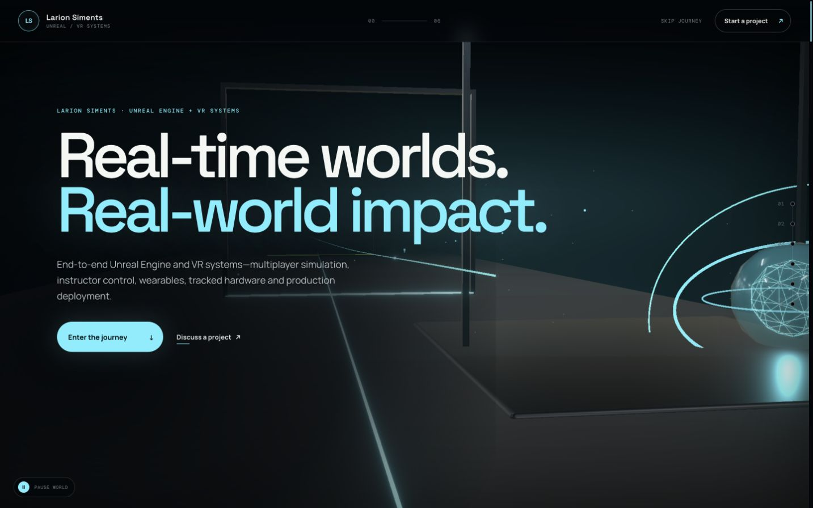

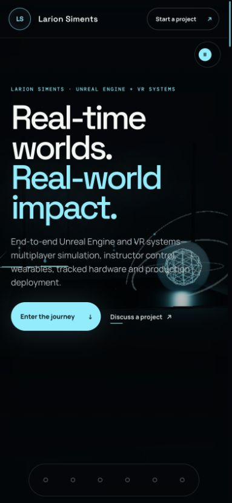

**What works:** The headline is confident, the entry CTA is obvious, and the editorial type scale immediately separates Playframe from a generic portfolio. The visitor understands that this is a guided experience.

**What fails:** The cropped wireframe orb looks like a familiar Three.js demo object rather than a studio signature. Huge pale construction panels flatten the depth. On mobile, the orb and signal line collide with the copy, while the lower half of the viewport has no meaningful composition.

**Premium direction:** Turn the arrival into a controlled system boot. Use a physically dimensional hero object, a restrained moving scan, and a glimpse of the journey beyond it. The CTA should visually activate the signal and move the visitor into the first world.

**Acceptance criteria:** No copy collision at 390 px; the hero object has a readable silhouette at first paint; one foreground, one midground, and one background layer are visible; the entry CTA remains the dominant interactive target.

### 01 — Clinical systems

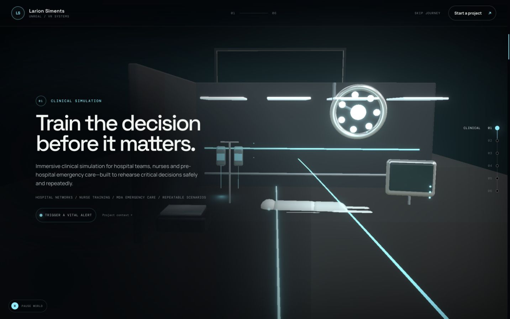

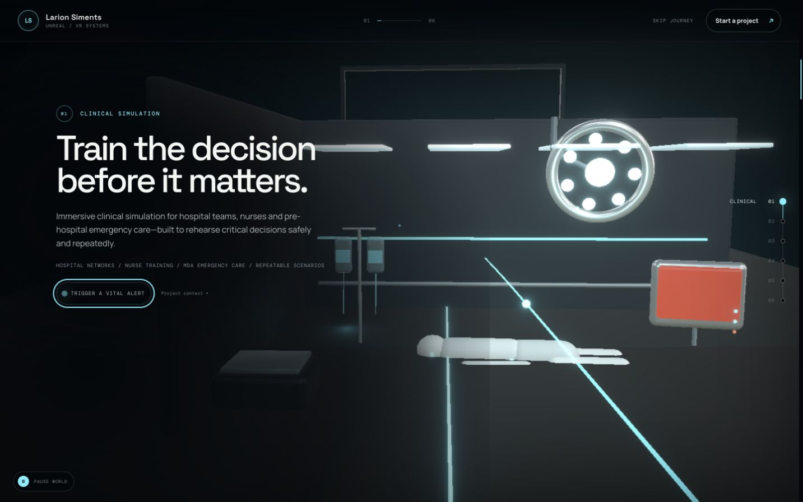

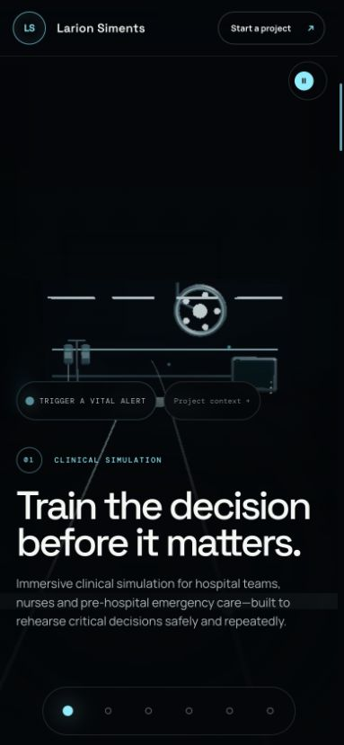

**What works:** The chapter communicates medical training without exposing restricted client work. The surgical light gives the scene an immediate category cue. The vital-alert interaction is semantically a real button.

**What fails:** The bed, monitor, IV, and trainee read as rough primitives. White-on-white materials lose edges. The surgical light clips the composition. The alert state simply turns the screen red; it does not reveal what changed or why the system matters. On mobile the entire scene is tiny and stranded under empty space.

**Premium direction:** Build a close, three-quarter bedside training shot around one credible hospital-bed / monitor assembly. Use a cool clinical key, warm practical spill, soft reflection, and a readable animated vital surface. Keep the room anonymized and fictional. The alert action should change the waveform, state label, ambient light, and instructor cue.

**Acceptance criteria:** The bed/monitor silhouette is recognizable without copy; critical equipment is not made from visible box/sphere primitives; alert state exposes meaningful visual feedback and an accessible state label; mobile subject height is at least roughly one third of the visual stage.

### 02 — Connected tactical training

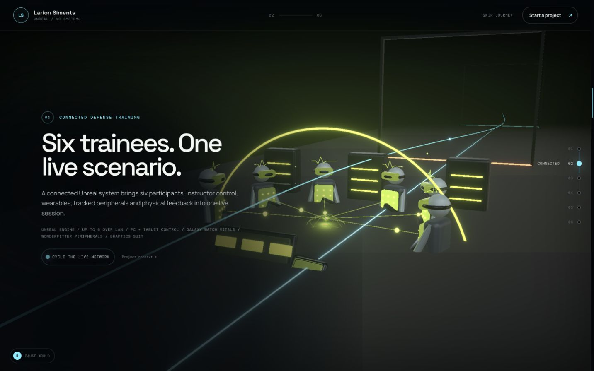

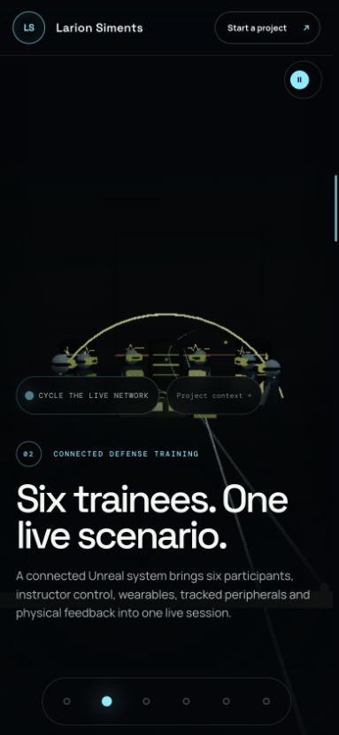

**What works:** The six-person topology, instructor-control idea, and connected-system story are structurally strong. This chapter contains the site’s most differentiated technical proposition.

**What fails:** Toy-like figures make advanced multiplayer simulation look lightweight. The rack and instructor console read as boxes. There is no hero view of the tracked equipment, wearable input, haptics, or operator dashboard. Mobile reduces the system to dots on an arc.

**Premium direction:** Treat the scene as an engineered multiplayer test bay. Use six understated real character silhouettes, one hero tracked-rifle / vest station, a large instructor tablet/dashboard, and a visible Galaxy Watch-style telemetry abstraction without branded design. Let the interaction route an event from the dashboard through the squad and return vital telemetry.

**Acceptance criteria:** Six participants are countable on desktop and mobile; the system has a clear input → squad → telemetry loop; one credible gear asset is shown close enough to read; dashboard content remains legible at the authored camera.

### 03 — Emergency response

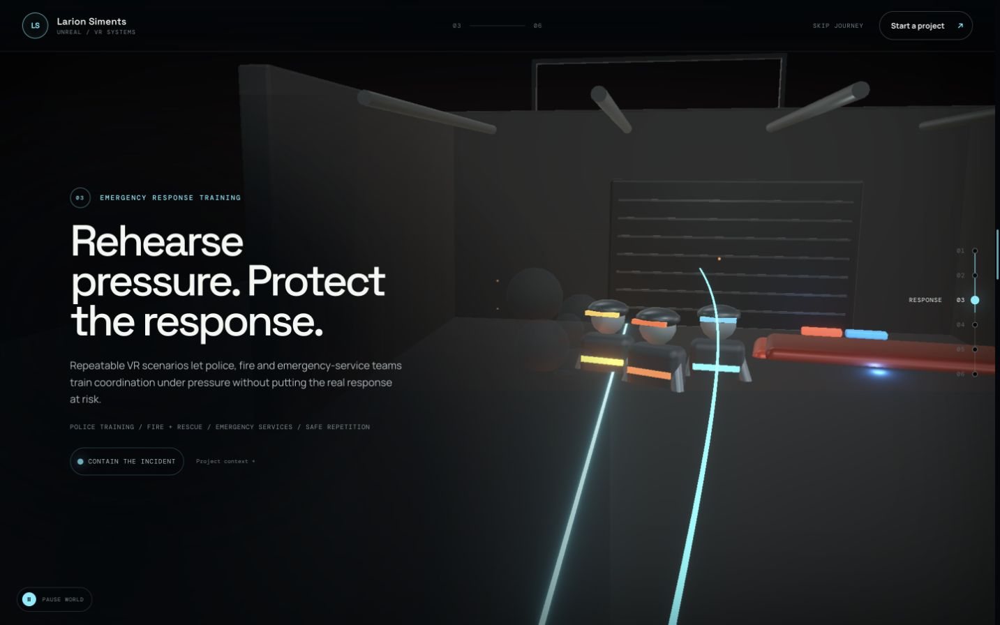

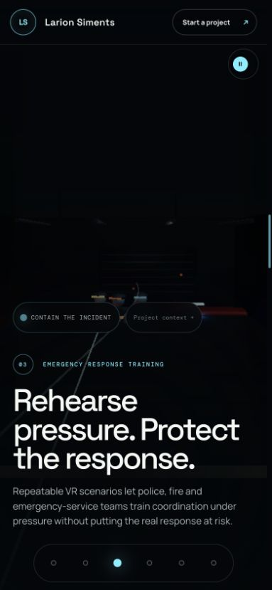

**What works:** The chapter belongs in the journey and supports the core serious-training positioning. The warehouse setting can create a strong spatial-training contrast after the clinical and tactical rooms.

**What fails:** This is currently the weakest credibility moment. Responders are toy figures, the vehicle is a long red block, smoke/fire is visually buried, and the cyan route overwhelms the incident. On mobile the event becomes almost invisible.

**Premium direction:** Use a night-response tableau with one credible responder as the hero, a fire-vehicle silhouette in the midground, wet ground, warm incident light, cool emergency strobes, volumetric smoke, and a route/hose line that supports rather than dominates. Keep insignia and agency branding fictional.

**Acceptance criteria:** A responder, incident source, and vehicle are identifiable at a glance; smoke and lighting remain performant; scene contrast passes visual review on mobile; the route line never masks the hero subject.

### 04 — Hover The Edge

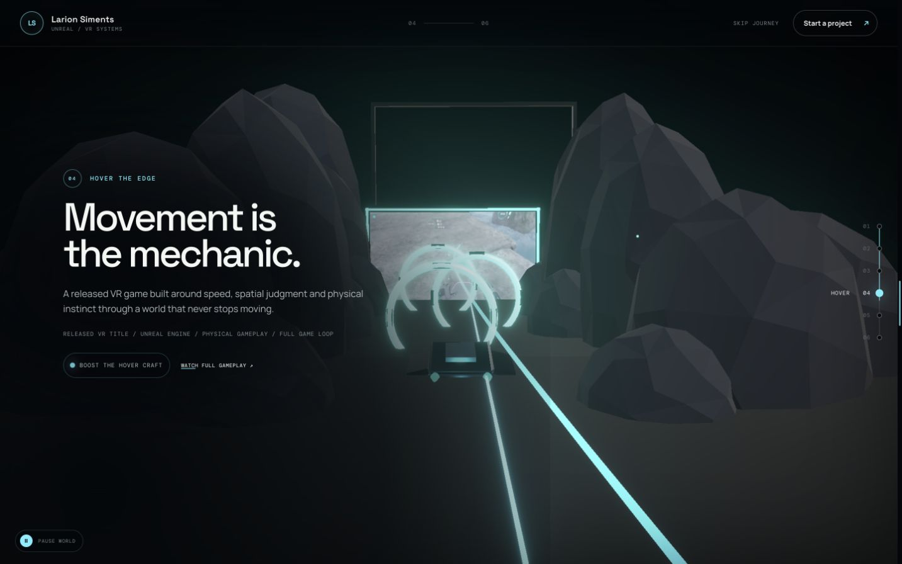

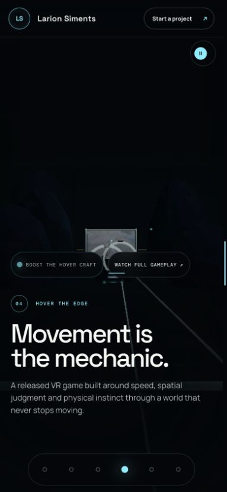

**What works:** Real gameplay is present and the racing-line transformation of the signal motif is appropriate. The chapter proves that Playframe can create entertainment, not only training systems.

**What fails:** The video is a postage stamp at the back of the scene. Generic faceted rocks and a tiny craft make the chapter feel like a mood board. There is no velocity, scale, or camera tension. Mobile action pills are visually larger than the work.

**Premium direction:** Make gameplay the hero—large, crisp, and immediately moving—then stage a real hovercraft mesh and optimized canyon geometry as foreground parallax. Use a low chase-camera angle, a warm quarry environment, dust, and a pulse that accelerates along the racing line.

**Acceptance criteria:** Video occupies a materially dominant part of the active desktop and mobile scene; craft silhouette is readable; footage is not excessively oblique; reduced-motion mode preserves a stable evidence frame; no decorative element competes with the video.

### 05 — FlyboxVR

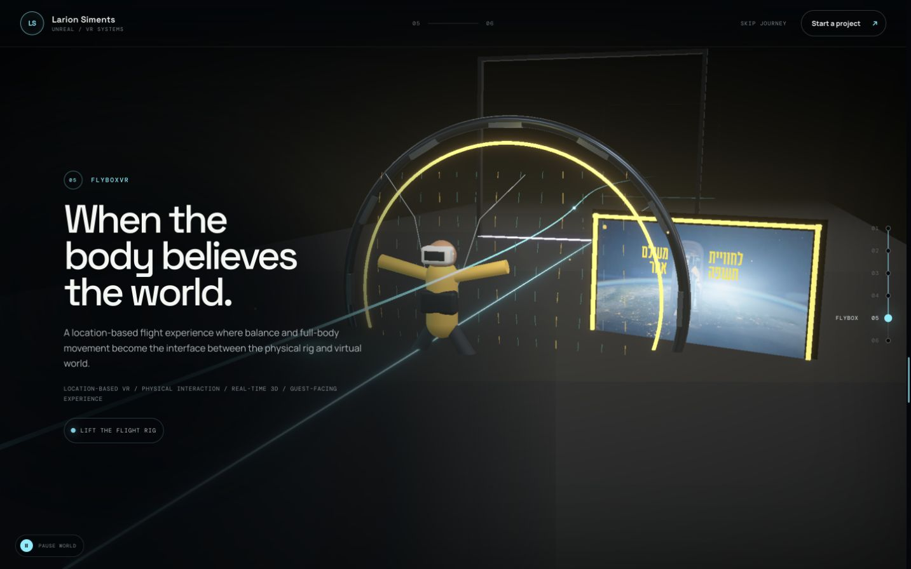

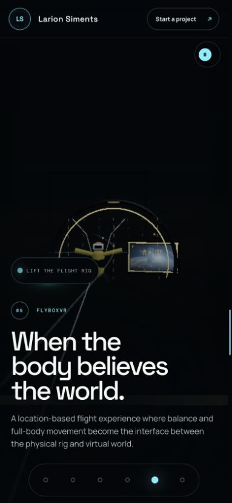

**What works:** The chamber, body, airflow, and real video already form a coherent concept. This is the most naturally immersive chapter.

**What fails:** The body remains mannequin-like, the ring and fans feel schematic, and the small angled footage plane with a visible UI frame becomes secondary. The camera shows the construction instead of the physical sensation.

**Premium direction:** Stage the chamber as a side-profile / over-shoulder hero shot. Increase the video surface, reduce the viewing angle, use a credible industrial fan or engineered panel kit, and light the body with cool airflow plus a warm edge. Air particles should move in a clear field, not uniform decorative noise.

**Acceptance criteria:** Footage and chamber subject form one composition; the video remains easy to parse; one engineered real-mesh anchor replaces the visibly scaffolded fan/ring; mobile visual scale increases substantially without covering copy.

### 06 — Mobile products

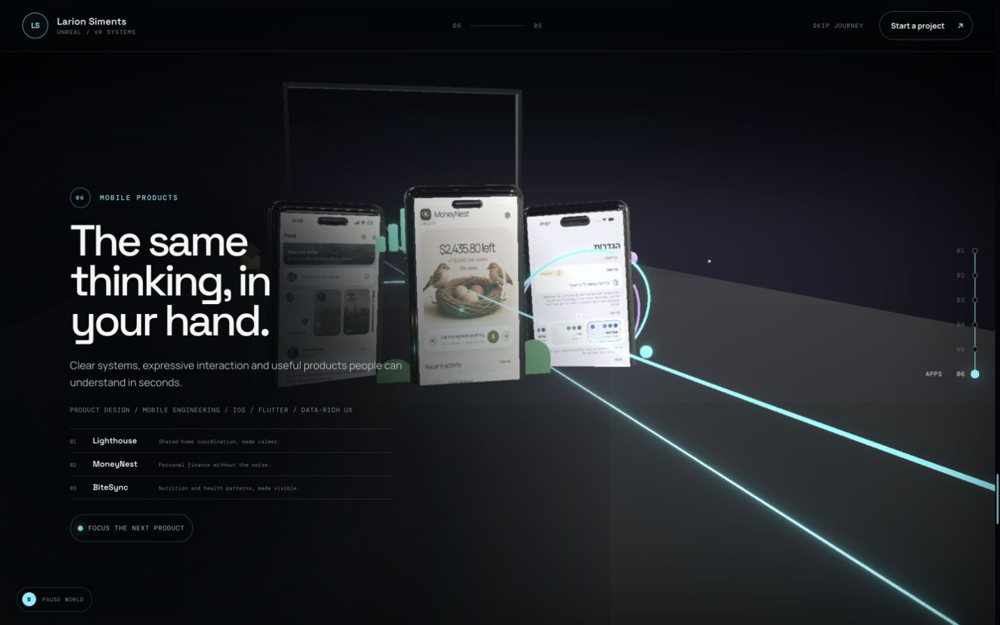

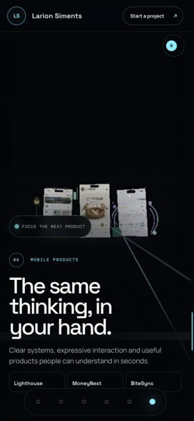

**What works:** This is currently the strongest proof moment. Real screens mapped to physical phones are immediately credible, visually rich, and specific.

**What fails:** The phones are still too small and low-contrast, screen content is slightly washed out, and the generic chapter copy undersells the visible products. Three equal devices create a display cluster rather than a focused product story.

**Premium direction:** Give the active phone clear dominance, identify Lighthouse / Nomad Home, MoneyNest, and BiteSync by name, and let focus shift among them with a restrained carousel motion. Use clean product-lighting reflections, crisp screens, and product-specific accent colors.

**Acceptance criteria:** At least one screen is readable at each target viewport; phone focus has a clear selected state; all three product names and roles are discoverable; screen textures retain correct aspect and contrast.

### Finale — Contact

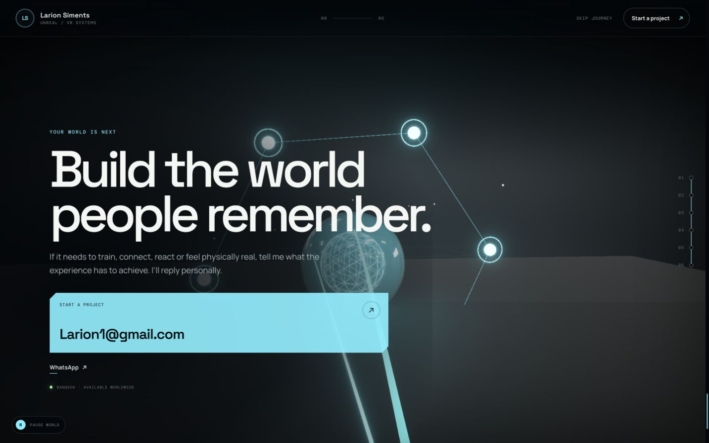

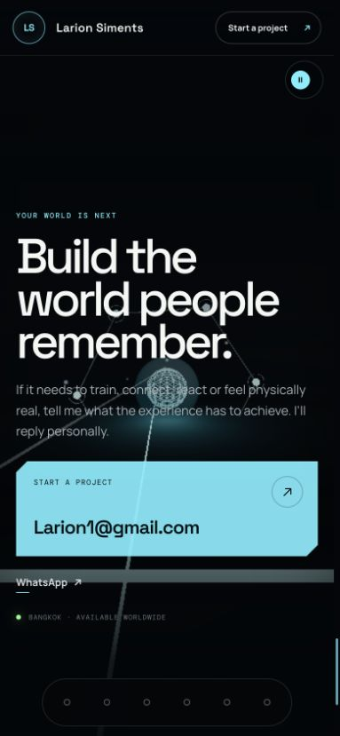

**What works:** The email CTA is obvious and the final headline has confidence.

**What fails:** Reusing the generic orb weakens the sense of arrival. The giant cyan email rectangle feels like a component demo. Mobile line breaks are awkward, the orb compromises body-copy contrast, and the WhatsApp row sits on a heavy bar. The journey counter returns to `00`, which feels unfinished.

**Premium direction:** Make the finale an editorial, quieter commissioning moment. Resolve the signal into a precise connection object or warm point of light, show a concise availability / fit statement, and offer email as the decisive primary action with WhatsApp as a calm secondary route.

**Acceptance criteria:** The final section is visually distinct from the hero; headline breaks are intentional at 390 px and 1440 px; CTA hierarchy is unambiguous; journey state reads as complete rather than reset.

## Interaction, motion, and content

### Interaction

Each scene action should reveal information, not merely recolor geometry. The clinical alert should expose a vital change; tactical control should send an event and return telemetry; emergency should change incident state; Hover should trigger a boost; Flybox should increase airflow; apps should focus the selected product. Every state needs a visible label and an accessible announcement.

### Motion

Motion should have three levels:

- **Journey motion:** slow camera travel and signal continuity.
- **Scene motion:** one characteristic loop per chapter (vital pulse, squad network, emergency strobe, racing flow, air field, phone focus).
- **Response motion:** a short, unmistakable reaction to user input.

Reduced-motion mode must remove camera drift, pointer parallax, noise, and large auto-motion while leaving information and navigation intact.

### Copy

Copy should use real system nouns and outcomes without disclosing restricted client material. Avoid generic creative-studio language. The work can remain anonymous while still being specific about scale, constraints, integrations, and what Playframe delivered.

## Asset and licensing direction

Use CC0 wherever possible: Poly Haven for selected physical props / HDRIs, ambientCG for surfaces, Quaternius for characters / animation / fictional equipment, and Khronos sample assets for vetted web-ready GLB references. Use CC BY only when a hero model materially improves the scene, and retain title, author, source, license URL, and modification notes in `public/THIRD_PARTY_NOTICES.txt`.

Do not ship marketplace assets whose licenses depend on preventing extraction; public GLB files are downloadable. Do not use noncommercial, share-alike, branded replica, franchise-derived, or unclear AI-generated meshes.

All imported assets should be reduced to the smallest useful piece, use 1K or smaller textures where possible, share materials, instance repeated geometry, and load by chapter. A practical target is 0.5–2.5 MB per hero prop and 1–3 MB per character after optimization.

## Validation requirements

The build is not complete until it has:

- fresh before/after comparisons at 1440 × 900 and 390 × 844;
- keyboard traversal through skip link, global navigation, chapter actions, next links, and contact CTAs;
- reduced-motion visual review;
- no clipping, floor intersections, unreadable footage, or copy collisions;
- no runtime errors and no actionable warnings introduced by this pass;
- a production build and asset-size review;
- live deployment verification after cache invalidation.

Screenshots establish visible evidence only. They do not by themselves prove accessibility, performance, or device compatibility; those require the explicit checks listed above.

## Post-execution review

The full task list was executed against the audit, then reviewed again at the original desktop and mobile viewports. The result no longer reads as a collection of Three.js demonstrations. It reads as one directed studio journey: a clear training-systems proposition, credible fictional reconstructions where client material cannot be shown, dominant real footage where it can, and a decisive contact moment.

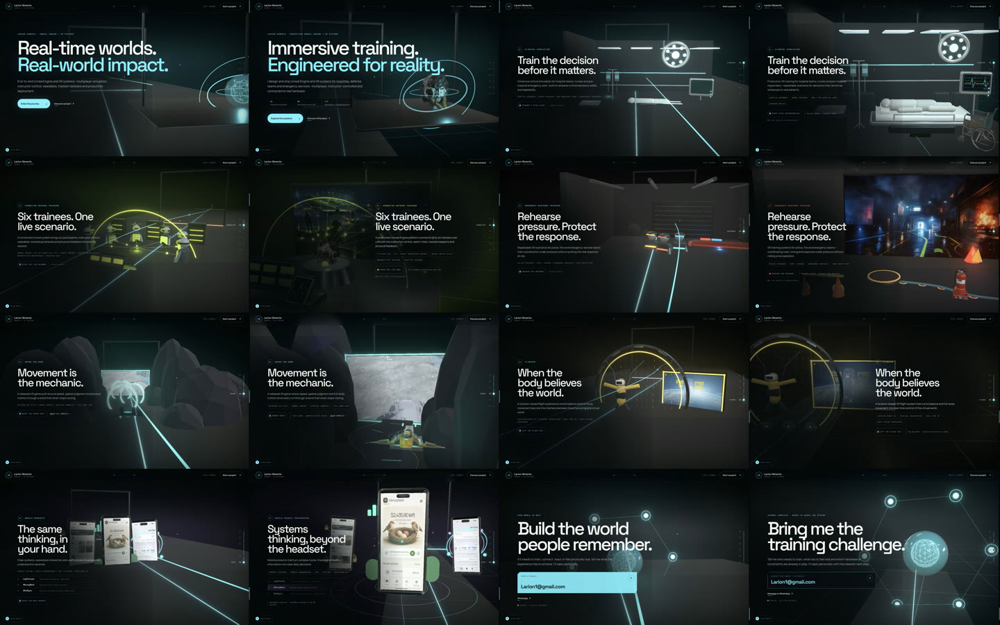

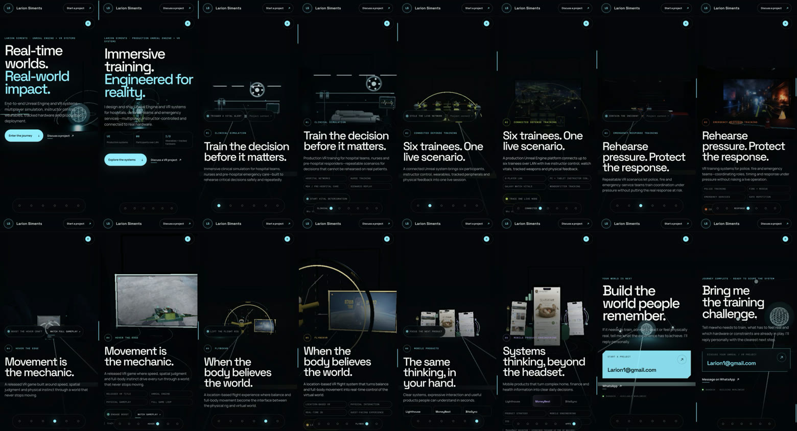

Within each comparison pair, the baseline is on the left and the executed build is on the right. Full-resolution final frames are retained in `docs/audit-evidence/after/desktop/` and `docs/audit-evidence/after/mobile/`.

### Final assessment

| Dimension | Before | After | Executed result |
|---|---:|---:|---|
| Art direction | 7.5 | 9.1 | One shared signal language now connects visibly different, authored worlds. |
| 3D craft | 5.5 | 8.8 | The most exposed placeholder geometry was replaced or subordinated to real evidence and commercially safe hero assets. |
| Cinematography | 5.5 | 9.1 | Every stop has a dedicated desktop/mobile shot, protected copy area, arrival hold, and intentional evidence hierarchy. |
| Content clarity | 7.5 | 9.3 | The offer, technical depth, six-part journey, real constraints, and next step are explicit without a prototyping message. |
| Proof / credibility | 6.0 | 9.0 | Real gameplay, Flybox footage, product screens, system UI, and credible reconstruction plates now dominate their chapters. |
| Mobile experience | 5.0 | 8.9 | Subjects are materially larger, controls are reordered, the rail no longer masks content, and horizontal overflow is zero. |
| Conversion path | 7.0 | 9.2 | The narrative resolves from critical training to technical range to a specific project brief and direct contact routes. |
| Accessibility readiness | 6.5 | 8.9 | Semantic landmarks, named controls, live state, pressed/selected state, skip link, visible focus, motion pause, and static fallbacks were verified. |

### What changed by chapter

**Arrival.** The generic wireframe-orb impression was replaced with a real sci-fi helmet as a technical artifact, restrained orbital signal lines, a larger proof strip, and copy that immediately states the production Unreal / VR offer. The shot reveals depth without letting the 3D object compete with the headline.

**Clinical.** The camera now resolves a complete bedside system. A real CC0 wheelchair, readable vital monitor, bed, IV equipment, and controlled clinical light create a credible anonymized training bay. The action exposes a named patient-state change and accessible status rather than a decorative recolor.

**Connected tactical.** Toy figures are no longer the evidence. A large reconstructed multiplayer-training plate, six readable system nodes, helmet, instructor surface, and generated operations interface explain the complete input → squad → telemetry loop while avoiding restricted client imagery.

**Emergency response.** The red box vehicle/mannequin tableau was replaced by a cinematic response reconstruction as the evidence surface, supported by three-dimensional fire, hose/route, beacon, and a sourced extinguisher. Warm incident light and cool response light now separate the event at a glance.

**Hover The Edge.** Gameplay became the largest visual surface and moved close to frontal. A CC0 Quaternius speeder now anchors the authored track foreground. The boost action visibly advances, lifts, scales, illuminates, and intensifies the craft. On mobile the craft remains inside the footage/track composition and no longer collides with the headline.

**FlyboxVR.** The footage, participant, engineered ring, airflow, and fan bank now share one side-profile composition. The participant was moved fully into frame and received a cool rim light; the footage angle was flattened so the real installation is legible rather than decorative.

**Mobile products.** One screen is now dominant, all three products are named, and Lighthouse, MoneyNest, and BiteSync can each become the selected 3D device. Selection exposes pressed state and a live status announcement. On mobile the product controls precede secondary capability tags.

**Contact.** The repeated hero orb became a quieter network-resolution object, the camera was panned away from the copy, the email action became an editorial commissioning card, WhatsApp became a calm secondary route, and journey state resolves as `DONE` rather than resetting to `00`.

### System-level execution

- Recessed and narrowed the shared facility spine so scene-owned floors and contact points are no longer cut in half.
- Re-authored all eight desktop and mobile camera shots with a 30 / 40 / 30 hold-travel-hold rhythm.
- Reduced global bloom, signal, portal, and repeated-light dominance; established chapter-specific cool, tactical, emergency, entertainment, and product palettes.
- Added chapter-aware presence settling without the former diorama zoom, plus a user-controlled world pause and stable image fallbacks.
- Added a generated fictional systems interface and integrated it into clinical, tactical, and emergency evidence surfaces.
- Added CC0 wheelchair, fire extinguisher, sci-fi helmet, and Hover speeder assets, with hashes, source links, modifications, and licenses retained in `public/assets/models/README.md` and `public/THIRD_PARTY_NOTICES.txt`.
- Rewrote metadata, Open Graph copy, chapter proof, interaction labels, finale copy, and the overall promise around production-grade Unreal Engine and VR training systems.
- Removed the mobile 451 px overflow condition; the final 390 px browser test reports equal document and client widths.

### Release validation

- `npm run typecheck`: passed.
- `npm run build`: passed; videos remain lazy and chapter models are progressively loaded as their scene gates mount.
- `git diff --check`: passed.
- Desktop visual evidence: eight final 1440 × 900 states captured and compared with the baseline in the same review sheet.
- Mobile visual evidence: eight final 390 × 844 states captured and compared with the baseline in the same review sheet.
- Browser runtime: zero console errors. One non-actionable `THREE.Clock` deprecation remains inside React Three Fiber's internal store; no project source instantiates `THREE.Clock`.
- Accessibility/interaction: semantic journey snapshot reviewed; skip link focus visibly enters the viewport; clinical, mobile-product, and contact controls accept focus; scene actions expose labels plus `aria-pressed`/live status; Hover boost and motion pause were exercised in-browser.
- Reduced-motion/fallback: motion pause freezes the Three.js layer while retaining content/navigation; reduced-motion and non-WebGL paths use stable evidence images/posters rather than empty scenes.
- Link contracts: project email, WhatsApp, gameplay, chapter anchors, replay, and contact paths were checked in the semantic browser snapshot.

### Remaining production constraint

The Three.js experience chunk is approximately 1.17 MB minified / 315 KB gzip. That is acceptable for a WebGL portfolio experience and is kept off the initial HTML/CSS bundle through dynamic loading, while media and sourced models remain separate requests. A future optimization pass could split chapter code further, but it is not a release blocker and would not materially improve the current first visual without a broader loading-strategy change.
