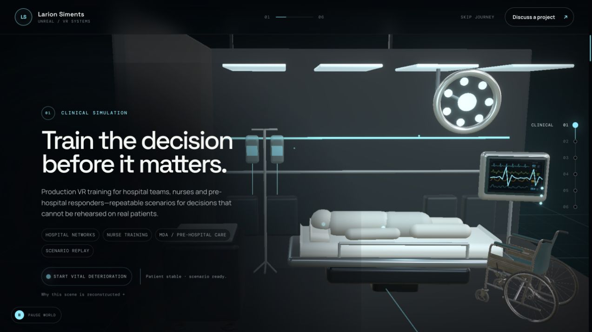
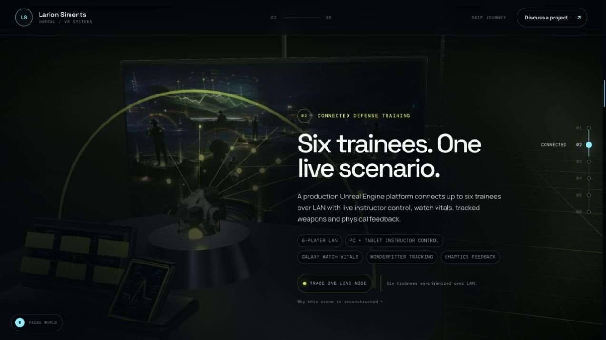
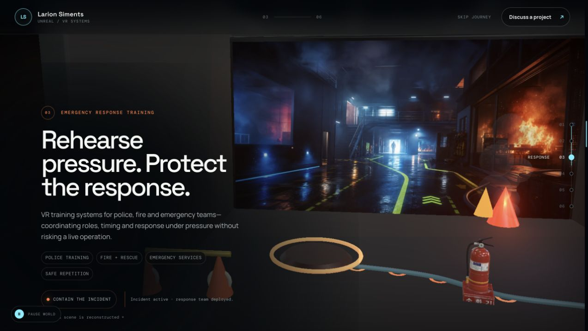
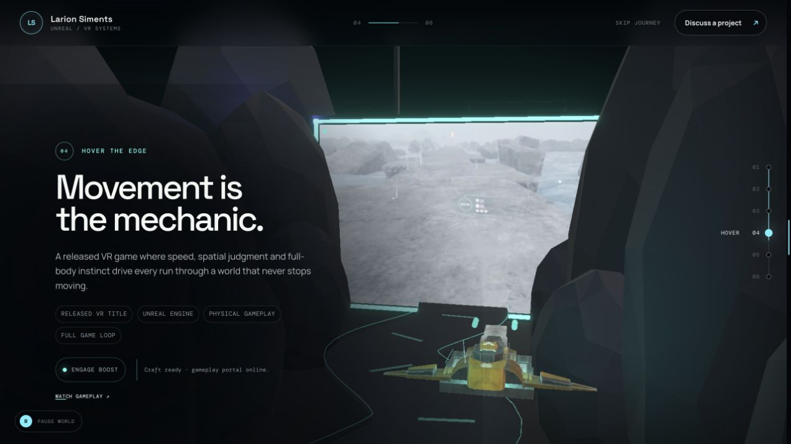
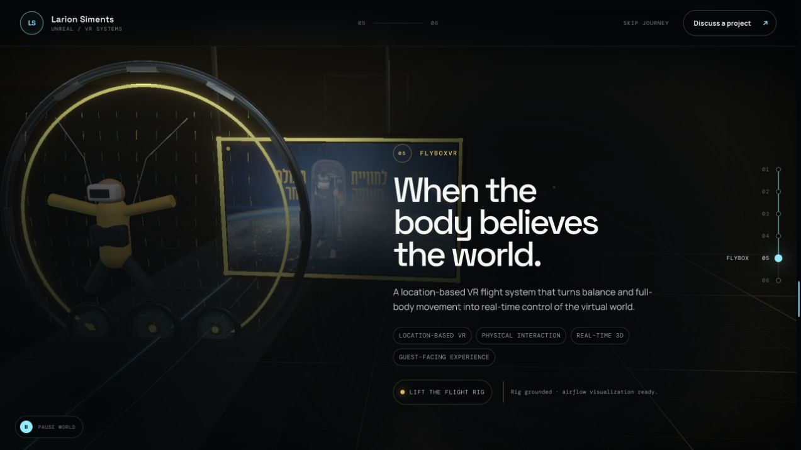
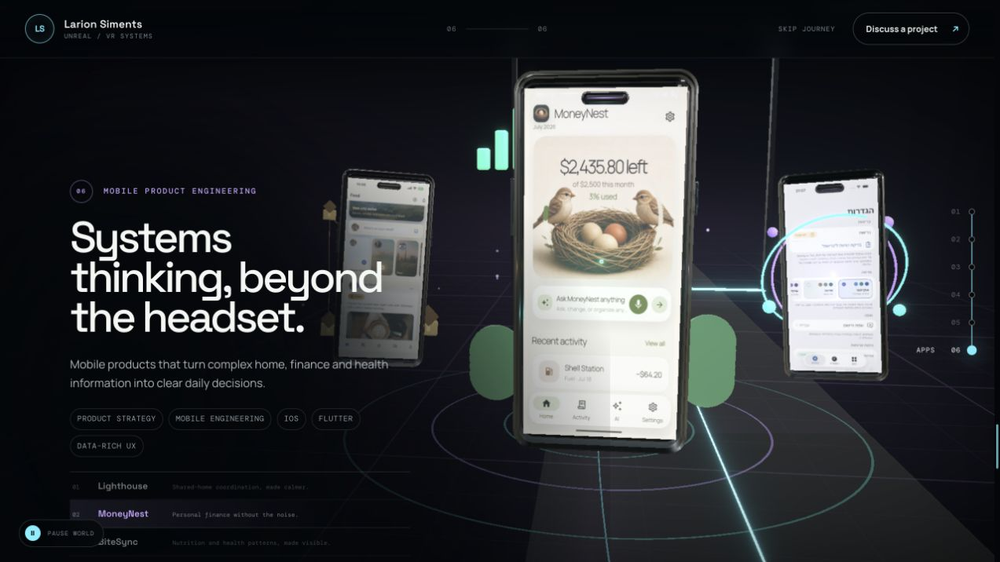
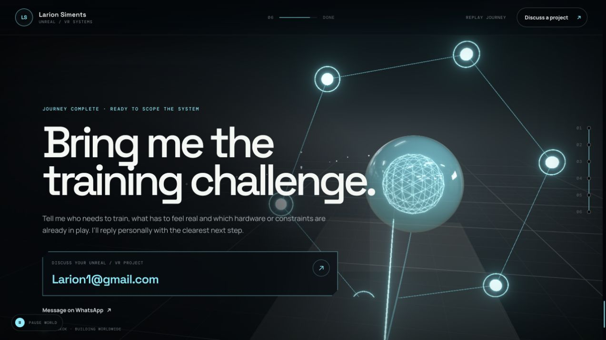

# Playframe story-first rebuild

**Direction locked:** 27 July 2026
**Evidence:** fresh desktop captures in [`audit-evidence/story-shift/before/desktop`](./audit-evidence/story-shift/before/desktop/), source-media inventory, runtime/code review, and primary research for *Hover The Edge*.

## The new rule

The page must communicate through cause and effect before it communicates through copy. Every station gets one consequential moment, one dominant visual subject, and one interaction that completes the story. Text may name what the visitor already sees; it may not rescue an unclear scene.

The continuous cyan signal remains the connective tissue, but its job changes by station: vital trace, network route, incident command, hoverboard energy, airflow, product focus, and finally a build impulse.

## Visual thesis

> One living signal moves through systems where the outcome matters. The visitor does not tour a gallery; they enter each system, cause a state change, and leave with proof of what Playframe can build.

The art hierarchy is:

1. **A readable moment** — the action and stakes are visible without text.
2. **Evidence** — real footage and shipped screens whenever they can be shown; clearly fictional reconstruction when client work is confidential.
3. **Physical depth** — WebGL foregrounds, atmosphere, and camera response make the evidence inhabitable.
4. **Copy** — one headline, one proof line, one restrained system note.

## Content plan

The journey answers seven questions in order:

1. Can Playframe make high-consequence clinical decisions trainable?
2. Can it orchestrate a complex connected XR system across people, hardware, and instructor controls?
3. Can it make emergency teams rehearse one incident from multiple roles?
4. Can it turn body movement into an original released VR game?
5. Can it turn a physical attraction into convincing flight?
6. Can the same product craft ship polished mobile software?
7. What could the visitor build with Playframe next?

## Interaction thesis

Every interaction is a verb that belongs to the product:

- Clinical: **stabilize** a deteriorating patient.
- Tactical: **route** an instructor event through six trainees and receive telemetry.
- Emergency: **coordinate** three roles until the incident is contained.
- Hover: **lean** to carve and hold to boost toward the artifact.
- Flybox: **take flight** and feel airflow accelerate around the real footage.
- Apps: **focus** one shipped product without stacking or losing another.
- Contact: **assemble** a new system, then launch the brief.

Pointer response must be subtle and physically motivated. Mobile horizontal gestures may control a local interaction, but vertical scrolling is never captured. Reduced-motion mode retains the narrative states without continuous drift.

## Brutal station review and rebuild direction

### 00 — Hero

**Status:** approved. Preserve the composition, proposition, primary action, and cinematic restraint. Only shared-state or regression fixes are allowed.

### 01 — Clinical decisions

**Failure:** The first proof point currently looks like a nicely lit empty set. The patient, instructor, clinical decision, and response loop are not the hero; the copy is. A monitor changing color is not a story.

**New five-second story:** A patient deteriorates. A trainee notices the change. The room, patient sensors, vital trace, and instructor timeline react together. The visitor intervenes, and the system resolves into a replayable decision path.

**Composition:** Tight trainee point of view at the bedside. Patient and hands dominate. A large cinematic reconstruction supplies realism and human action; the 3D bed, monitor, wheelchair crop, sensor trace, and observation layer add spatial evidence. Copy occupies less territory than the patient moment.

**State change:** Stable cyan → amber deterioration → intervention → recovered cyan, with the environment and timeline responding as one system.

**Acceptance:** The scenario reads before the headline; the button changes at least four linked visual cues; the confidential reconstruction is identified honestly; no toy-like medical geometry competes with the patient.

### 02 — Connected tactical training

**Failure:** The chapter says “six-person connected system” but visually shows a dark generic combat image and an abstract arc. The watch, instructor console, LAN, tracked devices, haptics, and return telemetry are missing from the visual argument.

**New five-second story:** An instructor launches an event from PC/tablet. It reaches six physical trainees over a local network. One trainee’s wearable, tracked training device, and haptic response light up. Telemetry closes the loop back at the instructor station.

**Composition:** One cohesive facility, not a collage. Instructor console is foreground evidence; six trainees remain countable in the middle depth; the reconstructed cinematic layer makes the full physical system legible. A single selected trainee reveals watch → equipment → haptics → telemetry.

**State change:** Event dispatch travels outward; biometric and performance data return on a distinct rhythm.

**Acceptance:** Six trainees are countable on desktop and mobile; the causal loop is readable without tags; no real client UI, insignia, or sensitive screenshot is implied.

### 03 — Coordinated emergency response

**Failure:** Cones, a hose ring, and an isolated extinguisher reduce serious multi-role training to a toy diorama. The background shows an incident, but the 3D layer does not explain what Playframe enables.

**New five-second story:** One simulated smoke incident unfolds. Fire reads heat and advances. Police clears a route. Medical establishes a safe triage zone. Three paths converge and the incident visibly stabilizes.

**Composition:** Shoulder-height behind the response, with a cinematic fictional reconstruction as the dominant evidence. Smoke and route light are volumetric narrative layers. Physical props remain cropped scale anchors, never the subject.

**State change:** Three role paths deploy in sequence, then converge; flame/smoke energy falls and the safe route changes from urgent amber to controlled cyan.

**Acceptance:** Fire, police, medical, incident source, and shared outcome are instantly distinguishable; no generic truck/toy responder geometry; containment changes the entire scene.

### 04 — Hover The Edge

**Failure:** The current spaceship is factually wrong. The external chase framing removes the game’s defining body-steered embodiment and hides the extraction objective.

**New five-second story:** The visitor looks down at a hoverboard, leans to carve through Kamilu Island, boosts across a broken route, collects energy, and sees the artifact beacon before the world collapses.

**Composition:** Recut owner footage fills most of the station. An original Blender-built hoverboard is camera-bound in the foreground, with only rain, route fragments, pickups, and an artifact beacon as 3D props.

**State change:** Pointer/drag controls lean; press-and-hold boosts the board, footage pace, FOV, trail, and artifact charge. Vertical mobile scroll remains untouched.

**Acceptance:** It reads as a hoverboard within one second; real footage is the hero; the objective and body control are understood without a paragraph; reduced motion is comfortable.

### 05 — FlyboxVR

**Failure:** Weak procedural meshes surround and diminish the strongest asset—the real video. The mannequin posture does not communicate belly-down flight, and the ring construction feels like a diagram.

**New five-second story:** A real participant commits to the horizontal flight pose; airflow accelerates; their body becomes the controller; the virtual flight world answers.

**Composition:** The real video is the largest object in the station and faces the camera. Tunnel/fan geometry lives only at the frame edges as parallax props. If a body silhouette remains, it is small, anatomically calm, and clearly prone/face-down.

**State change:** “Take flight” expands and brightens the footage, increases airflow and edge fan speed, and moves the prone silhouette into the stream.

**Acceptance:** Video wins every hierarchy test; no Hebrew-dependent screenshot is required to understand it; meshes never compete with or obscure the footage.

### 06 — Shipped mobile products

**Failure:** Selection can assign two phones the same transform, causing overlap/disappearance. BiteSync defaults to a Hebrew screen, which is inappropriate for this audience.

**New five-second story:** Three products orbit as a stable carousel. Selecting one gives it the center and reveals a distinct role while the other two remain visible in separate depth slots.

**Composition:** One dominant readable phone, two supporting phones, no object enters the copy column. BiteSync uses the German settings capture.

**State change:** A deterministic three-slot carousel rotates shortest-path; DOM and WebGL share one focus state, including after unmount/re-entry.

**Acceptance:** No overlap at any index or transition; all three phones remain discoverable; one screen is readable at every target viewport; no Hebrew screenshot.

### 07 — Invitation / contact

**Failure:** Six orbiting spheres feel like a generic WebGL ending and collide with the commissioning message. The location line adds no conversion value.

**New five-second story:** Three ingredients—challenge, system, experience—respond to the pointer, snap into one functioning core, and release a forward launch pulse. The interaction rehearses what collaboration with Playframe feels like: bring a hard brief, assemble the right system, ship something remarkable.

**Composition:** A tactile assembly object is offset from the copy and grows calmer when complete. Email remains the decisive conversion action. Location is removed.

**State change:** Hover attracts components; click assembles and launches; the email CTA receives the same completion pulse.

**Acceptance:** The ending feels distinct from the hero, playful but professional, and unmistakably invites a project; keyboard and reduced-motion paths receive the same completion state.

## System corrections required across stations

- Move all interaction state to one owner so DOM labels and WebGL scenes cannot disagree after lazy unmount/re-entry.
- Author per-transition camera moves instead of reusing one vertical arc.
- Keep cinematic reconstructions darker than live 3D response layers, while real project media remains unambiguously dominant.
- Eliminate copy/visual collisions at 1440 × 900 and 390 × 844.
- Keep the mobile journey rail clear of interaction controls.
- Preserve semantic buttons, focus visibility, `aria-live` state announcements, reduced motion, and scroll freedom.

## Success test

With the copy hidden, a reviewer should still be able to identify: clinical decision training, six-person connected tactical training, coordinated emergency response, body-steered hoverboarding, prone wind-tunnel flight, three shipped apps, and an invitation to assemble a new system. If any station fails that test, it is not finished.
